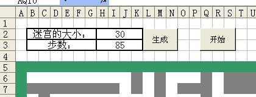

整体来说，算法优劣什么的没考虑过。当时就是想如果我用笔在纸上面画一个迷宫应该怎么画，然后代码就写出来了。可能整体的效率很低。

<!--break-->

代码实现两个功能：

1、迷宫绘制：

Main函数就是干这个的。

2、迷宫游戏：

Reset函数用来进行一些初始设定（每次玩之前都要设定一下）；

其他的就是利用Excel的Worksheet_SelectionChange函数实现“走步”。

有兴趣的朋友可以拿来玩一玩，消磨时间。

具体的使用：

将整个代码拷贝到Sheet1的编辑框（因为Worksheet_SelectionChange函数的限制）。

然后再Sheet1中建立两个按钮：

第一个按钮名字改成“生成”，指向的宏设置为“Main”；

第二个按钮名字叫“开始”，制定的宏设置为“Reset”。

如果顺序错了可能不好用。VBA我也不是很明白，就是没事琢磨了一下，没有系统的学过。

然后，在“H2”的位置输入迷宫的大小，是一个 5 ~ 250 之间的数字。当然也可以适当的修饰一下。比如附图的形式：



附：代码

```vb
'  1--Up
'  0--Down
'  3--Left
'  2--Right

 '  x--Row ; y--Column

 '  本程序算法无所谓快慢，完全按着普通人思维方式完成

 Dim  iMazeSize  As   Integer
 Dim  iMaze( 251 ,  251 )  As  Variant
 Dim  x, y, iGetRndRet, iPOrder, iNoWay  As   Integer
 Dim  subx, suby  As   Integer
 Dim  iStartLine  As   Integer
 Dim  bInit  As   Boolean
 Dim  bGoStart  As   Boolean
 Dim  bDrawing  As   Boolean
 Dim  CrtRow, CrtClm  As   Integer
 Dim  BckRow, BckClm  As   Integer
 Dim  iRowMax, iColumnMax  As   Integer
 Dim  iStepCnt  As   Integer

 Sub  Reset()
    bGoStart  =   Not  bGoStart

     If  (bGoStart)  Then
        ActiveSheet.Shapes( " Button 2 " ).Select
        Selection.Characters.Text  =   " 结束 "
        iStepCnt  =   0
        ActiveSheet.Cells( 3 ,  8 )  =  iStepCnt
        BckRow  =   6
        BckClm  =   2
        OutMazeColor  6 ,  2 ,  51
        Cells( 6 ,  2 ).Select
         For  i  =   7   To  ActiveSheet.UsedRange.Rows.Count
             For  j  =   5   To  ActiveSheet.UsedRange.Columns.Count
             If  (Cells(i, j).Interior.ColorIndex  =   15 )  Then
                iRowMax  =  i
                iColumnMax  =  j
             End   If
             Next
         Next
     Else
        ActiveSheet.Shapes( " Button 2 " ).Select
        Selection.Characters.Text  =   " 开始 "
     End   If


 End Sub


 Private   Sub  Worksheet_SelectionChange(ByVal Target  As  Range)
     If  ((bGoStart)  And  ( Not  bDrawing))  Then
        CrtRow  =  ActiveCell.Row
        CrtClm  =  ActiveCell.Column
         If   Not  (bInit)  Then
            BckRow  =   6
            BckClm  =   2
            bInit  =   True
         End   If

        OutMazeColor BckRow, BckClm,  2
         If  (( Abs (CrtRow  -  BckRow)  <=   1 )  And  ( Abs (CrtClm  -  BckClm)  <=   1 ))  Then
             If  (CrtRow  =  (iRowMax))  And  (CrtClm  =  (iColumnMax))  Then
                 MsgBox   " Succ! "
                bGoStart  =   False
                ActiveSheet.Shapes( " Button 2 " ).Select
                Selection.Characters.Text  =   " 开始 "
                OutMazeColor CrtRow, CrtClm,  51
                ActiveSheet.Cells(CrtRow, CrtClm).Select
             ElseIf  (Cells(CrtRow, CrtClm).Interior.ColorIndex  <>   2 )  Then
                CrtRow  =  BckRow
                CrtClm  =  BckClm
                OutMazeColor CrtRow, CrtClm,  51
                ActiveSheet.Cells(BckRow, BckClm).Select
             Else
                iStepCnt  =  iStepCnt  +   1
                ActiveSheet.Cells( 3 ,  8 )  =  iStepCnt
                OutMazeColor CrtRow, CrtClm,  51
                ActiveSheet.Cells(CrtRow, CrtClm).Select
             End   If
         Else
            CrtRow  =  BckRow
            CrtClm  =  BckClm
            OutMazeColor CrtRow, CrtClm,  51
            ActiveSheet.Cells(BckRow, BckClm).Select
         End   If

        BckRow  =  CrtRow
        BckClm  =  CrtClm
     End   If
 End Sub


 Sub  maim()
    iMazeSize  =  Cells( 2 ,  8 )
    iStartLine  =   5

     If  (( 5   <=  iMazeSize)  And  (iMazeSize  <=   250 ))  Then
     ElseIf  (iMazeSize  =   0 )  Then
        iMazeSize  =   20
     Else
         MsgBox   " 迷宫大小应该在5~250之间。 "
         Exit   Sub
     End   If

     For  i  =   0   To   251
         For  j  =   0   To   251
            iMaze(i, j)  =   0
         Next
     Next

    MakeMaze
    OutMaze

 End Sub

 Private   Sub  MakeMaze()

    MakeMazeMainLine
    MakeMazeSubLine

 End Sub


 Private   Sub  OutMaze()

     Dim  i  As   Long


    iRowMax  =  ActiveSheet.UsedRange.Rows.Count
    iColumnMax  =  ActiveSheet.UsedRange.Columns.Count

    Range(Cells( 1 ,  1 ), Cells(iRowMax, iColumnMax)).Select
    Selection.Interior.ColorIndex  =  xlNone

     For  i  =   1   To  iMazeSize  +   2
        Columns(i).Select
        Selection.ColumnWidth  =   1.75
     Next


     For  j  =   1   To  iMazeSize  +   2
        OutMazeColor iStartLine, j,  50
     Next
     For  i  =  iStartLine  To  iMazeSize  +  iStartLine  -   1
        OutMazeColor i  +   1 ,  1 ,  50
         For  j  =   1   To  iMazeSize
             If  (iMaze(i  -  iStartLine, j  -   1 )  =   1 )  Then
                OutMazeColor i  +   1 , j  +   1 ,  2
             ElseIf  (iMaze(i  -  iStartLine, j  -   1 )  =   2 )  Then
                OutMazeColor i  +   1 , j  +   1 ,  2
             ElseIf  (iMaze(i  -  iStartLine, j  -   1 )  =   0 )  Then
                OutMazeColor i  +   1 , j  +   1 ,  16
             ElseIf  (iMaze(i  -  iStartLine, j  -   1 )  =   99 )  Then
                OutMazeColor i  +   1 , j  +   1 ,  15
             ElseIf  (iMaze(i  -  iStartLine, j  -   1 )  =   100 )  Then
                OutMazeColor i  +   1 , j  +   1 ,  15
             Else
                OutMazeColor i  +   1 , j  +   1 ,  16
             End   If
         Next
        OutMazeColor i  +   1 , j  +   1 ,  50
     Next
     For  j  =   1   To  iMazeSize  +   2
        OutMazeColor iStartLine  +  iMazeSize  +   1 , j,  50
     Next

    Cells( 1 ,  1 ).Select
 End Sub

 Private   Sub  OutMazeColor(ByVal x  As   Integer , ByVal y  As   Integer , ByVal c  As   Integer )
    bDrawing  =   True
    Range(Cells(x, y), Cells(x, y)).Select
     With  Selection.Interior
        .ColorIndex  =  c
        .Pattern  =  xlSolid
     End   With
    bDrawing  =   False
 End Sub

 Private   Sub  MakeMazeMainLine()

    x  =   0
    y  =   0
    iPOrder  =   3

    iMaze(x, y)  =   1
    iMaze(iMazeSize, iMazeSize)  =   1

     Do   While  (y  <  iMazeSize  -   2 )
        iGetRndRet  =  iGetRnd  Mod   6
         If  (iGetRndRet  =   0   Or  iGetRndRet  =   4 )  Then
             If  ((y  >=  (iMazeSize  -   2 ))  Or  (iPOrder  =   3 ))  Then
             Else
                y  =  y  +   1
                iMaze(y, x)  =   1
                y  =  y  +   1
                iMaze(y, x)  =   1
                iPOrder  =   0
             End   If
         ElseIf  (iGetRndRet  =   1   Or  iGetRndRet  =   3 )  Then
             If  ((x  >=  (iMazeSize  -   2 ))  Or  (iPOrder  =   2 ))  Then
             Else
                x  =  x  +   1
                iMaze(y, x)  =   1
                x  =  x  +   1
                iMaze(y, x)  =   1
                iPOrder  =   1
             End   If
         ElseIf  (iGetRndRet  =   2   Or  iGetRndRet  =   5 )  Then
             If  ((x  <=   3 )  Or  (iPOrder  =   1 )  Or  (iPOrder  =   3 ))  Then
             Else
                x  =  x  -   1
                iMaze(y, x)  =   1
                x  =  x  -   1
                iMaze(y, x)  =   1
                iPOrder  =   2
             End   If
         End   If
     Loop
     For  i  =  x  To  iMazeSize
        iMaze(y, i)  =   1
     Next
 End Sub

 Private   Sub  MakeMazeSubLine()
     Dim  iFlag  As   Boolean
     Dim  iCnt  As   Integer

    iFlag  =   True
     Do   While  ((iFlag)  And  (iCnt  <   100 ))
        iCnt  =  iCnt  +   1
        iPOrder  =   4
        iNoWay  =   0

        iFlag  =   False
         For  subx  =   0   To  iMazeSize Step  1
             For  suby  =   0   To  iMazeSize Step  1
                 If  (GetNeedWay(suby, subx))  Then
                     If  GetLeftWay(suby, subx)  Then
                        DrawSubLine
                        iMaze(y, x)  =   2
                     End   If
                     If  GetRightWay(suby, subx)  Then
                        DrawSubLine
                        iMaze(y, x)  =   2
                     End   If
                     If  GetUpWay(suby, subx)  Then
                        DrawSubLine
                        iMaze(y, x)  =   2
                     End   If
                     If  GetDownWay(suby, subx)  Then
                        DrawSubLine
                        iMaze(y, x)  =   2
                     End   If
                    iFlag  =   True
                 End   If
             Next
         Next
     Loop
    iMaze( 0 ,  0 )  =   99
    iMaze(iMazeSize  -   1 , iMazeSize  -   1 )  =   100

 End Sub

 Private   Function  GetLeftWay(ByVal iy  As   Integer , ByVal ix  As   Integer )  As   Boolean

     For  j  =  iy  To   1  Step  - 1
         If  ((((j  /   2 )  =  ( Int (j  /   2 ))))  And  ((ix  /   2 )  =  ( Int (ix  /   2 ))))  Then
             If  (iMaze(j, ix)  <>   0 )  Then
                x  =  ix
                y  =  j
                GetLeftWay  =   True
                 Exit   Function
             End   If
         End   If
     Next
    GetLeftWay  =   False

 End Function
 Private   Function  GetRightWay(ByVal iy  As   Integer , ByVal ix  As   Integer )  As   Boolean

     For  j  =  iy  To  iMazeSize Step  1
         If  ((((j  /   2 )  =  ( Int (j  /   2 ))))  And  ((ix  /   2 )  =  ( Int (ix  /   2 ))))  Then
             If  (iMaze(j, ix)  <>   0 )  Then
                x  =  ix
                y  =  j
                GetRightWay  =   True
                 Exit   Function
             End   If
         End   If
     Next
    GetRightWay  =   False

 End Function
 Private   Function  GetUpWay(ByVal iy  As   Integer , ByVal ix  As   Integer )  As   Boolean

     For  j  =  ix  To   1  Step  - 1
         If  ((((j  /   2 )  =  ( Int (j  /   2 ))))  And  ((iy  /   2 )  =  ( Int (iy  /   2 ))))  Then
             If  (iMaze(iy, j)  <>   0 )  Then
                x  =  j
                y  =  iy
                GetUpWay  =   True
                 Exit   Function
             End   If
         End   If
     Next
    GetUpWay  =   False

 End Function
 Private   Function  GetDownWay(ByVal iy  As   Integer , ByVal ix  As   Integer )  As   Boolean


     For  j  =  ix  To  iMazeSize Step  1
         If  ((((j  /   2 )  =  ( Int (j  /   2 ))))  And  ((iy  /   2 )  =  ( Int (iy  /   2 ))))  Then
             If  (iMaze(iy, j)  <>   0 )  Then
                x  =  j
                y  =  iy
                GetDownWay  =   True
                 Exit   Function
             End   If
         End   If
     Next
    GetDownWay  =   False
 End Function

 Private   Function  GetNeedWay(ByVal iy  As   Integer , ByVal ix  As   Integer )  As   Boolean
     Dim  iSum  As   Integer

    iSum  =   0
     For  i  =   0   To   1
         For  j  =   0   To   1
            iSum  =  iSum  +  iMaze(iy  +  i, ix  +  j)
         Next
     Next

     If  (iy  >=  (iMazeSize  -   1 ))  Then
        GetNeedWay  =   False
     ElseIf  (ix  >=  (iMazeSize  -   1 ))  Then
        GetNeedWay  =   False
     ElseIf  (ix  <   2 )  Then
        GetNeedWay  =   False
     ElseIf  (iy  <   2 )  Then
        GetNeedWay  =   False
     ElseIf  (iSum  =   0 )  Then
        GetNeedWay  =   True
     Else
        GetNeedWay  =   False
     End   If

 End Function

 Private   Sub  DrawSubLine()
    iNoWay  =   0
     Do   While  ( 1 )
        iGetRndRet  =  iGetRnd  Mod   4
         If  (iGetRndRet  =   0 )  Then
             If  (y  >  (iMazeSize  -   2 ))  Then
                iNoWay  =  iNoWay  +   1
             ElseIf  ((iMaze(y  +   2 , x)  <>   0 ))  Then
                iNoWay  =  iNoWay  +   1
             ElseIf  (iPOrder  =   1 )  Then
             Else
                y  =  y  +   1
                iMaze(y, x)  =   2
                y  =  y  +   1
                iMaze(y, x)  =   2
                iPOrder  =   0
             End   If
         ElseIf  (iGetRndRet  =   1 )  Then
             If  ((y  <   2 ))  Then
               iNoWay  =  iNoWay  +   1
             ElseIf  ((iMaze(y  -   2 , x)  <>   0 ))  Then
               iNoWay  =  iNoWay  +   1
             ElseIf  (iPOrder  =   0 )  Then
             Else
                y  =  y  -   1
                iMaze(y, x)  =   2
                y  =  y  -   1
                iMaze(y, x)  =   2
                iPOrder  =   1
             End   If
         ElseIf  (iGetRndRet  =   2 )  Then
             If  ((x  >  (iMazeSize  -   2 )))  Then
               iNoWay  =  iNoWay  +   1
             ElseIf  (iMaze(y, x  +   2 )  <>   0 )  Then
               iNoWay  =  iNoWay  +   1
             ElseIf  (iPOrder  =   3 )  Then
             Else
                x  =  x  +   1
                iMaze(y, x)  =   2
                x  =  x  +   1
                iMaze(y, x)  =   2
                iPOrder  =   3
             End   If
         ElseIf  (iGetRndRet  =   3 )  Then
             If  ((x  <   2 ))  Then
                iNoWay  =  iNoWay  +   1
             ElseIf  (iMaze(y, x  -   2 )  <>   0 )  Then
                iNoWay  =  iNoWay  +   1
             ElseIf  ((iPOrder  =   1 )  Or  (iPOrder  =   2 ))  Then
             Else
                x  =  x  -   1
                iMaze(y, x)  =   2
                x  =  x  -   1
                iMaze(y, x)  =   2
                iPOrder  =   3
             End   If
         End   If
         If  (iNoWay  >=   4 )  Then
             Exit   Do
         End   If
     Loop

 End Sub

 Private   Function  iGetRnd()  As   Integer

    iGetRnd  =   Int (( 1000   -   0   +   1 )  *   Rnd   +   0 )

 End Function
```

原文发表于：[csdn.net 2007-10-31 12:54:00](http://blog.csdn.net/zeerd)
