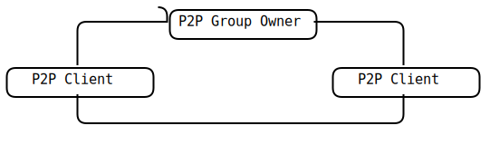

<!--break-->

# 1. WI-FI

## 1.1 简介

WI-FI（或Wi-Fi、WIFI），在大众的眼中是一种基于IEEE 802.11标准的无线网络链接方式。但是，实际上WI-FI是制定IEEE 802.11标准的组织的名称，只是我们已经习惯于使用这个组织的名称来描述这种网络连接方式。

通常，在WI-FI的支持下，两个设备之前可以通过自由链接（ad-hoc）、基于基站（Base Station，BS）的链接或基于链接点（Access Point，AP）的链接进行互联。这里我们只谈论目前应用最广泛的基于AP的链接方式。如果读者有兴趣可以自行查找资料获取另外两种方式的信息。

## 1.2术语

-   站点（Station），网络最基本的组成部分。

-   基本服务单元（Basic Service
    Set，BSS）。网络最基本的服务单元。最简单的服务单元可以只由两个站点组成。站点可以动态的联结（associate）到基本服务单元中。

-   分配系统（Distribution
    System，DS）。分配系统用于连接不同的基本服务单元。分配系统使用的媒介（Medium）逻辑上和基本服务单元使用的媒介是截然分开的，尽管它们物理上可能会是同一个媒介，例如同一个无线频段。

-   接入点（Access
    Point，AP）。接入点即有普通站点的身份，又有接入到分配系统的功能。

-   扩展服务单元（Extended Service
    Set，ESS）。由分配系统和基本服务单元组合而成。这种组合是逻辑上并非物理上的──不同的基本服务单元物有可能在地理位置相去甚远。分配系统也可以使用各种各样的技术。

-   关口（Portal），也是一个逻辑成分。用于将无线局域网和有线局域网或其它网络联系起来。

## 1.3 世代

-   第一代802.11，1997年制定，只运行于2.4GHz，最快2Mbit/s

-   第二代802.11b，只运行于2.4GHz，最快11Mbit/s，正逐渐淘汰

-   第三代802.11g/a，分别运行于2.4GHz和5GHz，最快54Mbit/s

-   第四代802.11n，可运行于2.4GHz或5GHz，20和40MHz带宽下最快72和150Mbit/s

-   第五代802.11ac，只运行于5GHz

## 1.4运作原理

基于AP的WI-FI的网络至少需要一个Access Point（AP）和一个或一个以上的client（HI）。AP每100ms将SSID（Service Set Identifier）经由beacons（信号台）数据包广播一次，beacons数据包的传输速率是1 Mbit/s，并且长度相当的短，所以这个广播动作对网络性能的影响不大。

因为WI-FI规定的最低传输速率是1 Mbit/s，所以可以确保所有的WI-FI client端都能收到这个SSID广播数据包，client可以借此决定是否要和拥有这个SSID的AP连接。

用户可以设置要连接到哪一个SSID。

## 1.5 基本实现

Linux下实现WI-FI机能时，通常有两个选择：connman和wpa\_supplicant。

前者是基于GPL协议开放的网络工具包。其优点是封装性比较好，可以通过公开的D-BUS接口方便的进行各种控制。后者是基于BSD协议开放的网络工具包。其优点是授权协议限制少，不会引发版权问题。

这里介绍的是基于wpa\_supplicant的实现方式。

wpa\_supplicant的网络管理控制有两个入口，一个是配置文件、另一个是命令行参数。因此，在使用wpa\_supplicant的方式管理网络时，经常需要重起wpa\_supplicant进程已实现不同的控制目的。

### 1.5.1 WI-FI功能的ON/OFF控制

针对WI-FI功能的ON/OFF控制是通过控制wpa\_supplicant进程的启动和停止来实现的。简单的说，需要WI-FI功能开启时，后台启动wpa\_supplicant进程；需要WI-FI功能关闭时，结束掉wpa\_supplicant进程。进程的启动可以通过系统调用execv()来实现，结束通过kill()来实现。具体用法请读者参照linux man手册。

### 1.5.2 WI-FI的搜索功能

wpa\_supplicant工具包实际上由多个可执行文件组成。我们主要会用到下面两个工具：

wpa\_supplicant是一个后台服务进程，负责进行具体的动作执行。而wpa\_cli就是一个客户端程序，用于发布命令。

搜索的命令是：scan。通常使用的格式如下：

```
wpa_cli -p/tmp/wlan0 -iwlan0 scan
```

其中-p参数帮助用户创建一个控制Sockets，-i参数用于指定使用的网络接口名称。

执行过上述命令之后，就可以通过scan\_results命令获取搜索的结果：

```
wpa_cli -p/tmp/wlan0 -iwlan0 scan_results
```

结果的格式如下：
```
bssid / frequency / signal level / flags / ssid

aa:bb:cc:dd:ee:ff 2432 94 [WPA2-PSK-TKIP+CCMP][ESS] testing
```

此时需要借助一些方法将命令行的输出内容重定向到程序可以读取的地方（比如重定向到临时文件中，再从临时文件中读出到内存）。然后对这些结果进行收集和拆分，以备它用。

## WI-FI的连接功能

wpa的WI-FI连接过程是基于网络ID（Network ID）实现的。因此，首先需要通过wpa\_cli命令获取一个ID：

```
wpa_cli -p/tmp/wlan0 -iwlan0 add_network
```

这个命令会返回一个ID号。获取ID号之后，需要向这个网络ID传入连接参数：

```
wpa_cli -p/tmp/wlan0 -iwlan0 set_network <network_id> ssid <ssid>

wpa_cli -p/tmp/wlan0 -iwlan0 set_network <network_id> psk <password>
```

传入的参数通常是SSID（即准备链接到的那个AP的SSID），以及这个AP的连接密码。

参数设定好之后，激活这个网络。连接就创建完成了。

```
wpa_cli -p/tmp/wlan0 -iwlan0 enable_network <network_id>
```

如果AP没有密码，则上面第二条命令替换成：

```
wpa_cli -p/tmp/wlan0 -iwlan0 set_network <network_id> key_mgmt NONE
```

## WI-FI的IP分配

连接创建成功之后，还需要进行最后一步。即IP分配。

如果是手动设置IP，则调用ifconfig命令完成；如果是自动分配IP则调用udhcpc或同等功能的命令进行。

# 2. WI-FI Direct

## 2.1 简介

WI-FI Direct 一般被翻译为WI-FI直连，之前曾被称为WI-FI 点对点（WI-FI Peer-to-Peer，WI-FI P2P），是一套软件协议，让 WI-FI
设备可以不必通过无线网络链接点（Access Point），以点对点的方式直接与另一个 WI-FI 设备连接，进行高速数据传输。

这个协议由WI-FI联盟发布、提供支持并授予认证，通过认证的产品将可获得WI-FI认证WI-FI Direct标志。

WI-FI Direct构架在原有的 802.11a、802.11g、802.11n之上，不支持802.11b。比既有的ad-hoc模式更快，同时也支持 WPA2 加密机制。最大传输距离是200米，最大传输速度为250Mbps，使用2.4GHz与5GHz频段。它支持一对一，以及一对多模式。

因为它属于软件协议，理论上，旧有的WI-FI设备，有可能通过固件与软件升级获得兼容性，不过WI-FI联盟并不保证芯片商一定会支持升级。

## 2.2 为什么需要WI-FI Direct

现在，WI-FI作为一项基本功能已经进驻到智能电话和其他各种可移动的媒体设备中。

同时，一些类似于UPnP（微软发起并被广泛应用与各种媒体设备之间的无缝连接的协议）和Bonjour（类似UPnP但是被苹果公司广泛使用的协议）的设备越来越多的出现在我们的日常生活之中。

这就导致了，基于ad-hoc的网络结构变得越来越重要。人们需要一种可以跳过中央WI-FI HUB或路由的机制，来实现更加便捷的网络构建方式。比如一台笔记本电脑需要在没有AP的情况下连接到一台打印机上。此时，基于ad-hoc的网络原本可以实现这个目的，但是它的繁杂的链接信息设置方式阻挡了人们的脚步。

此时，WI-FI Direct应运而生。话筒、键盘、遥控器、耳机、音箱、显示器以及其他各种设备都可以基于WI-FI Direct的方式进行连接。而且无线显示技术比如WiDi或者Miracast都是基于WI-FI Direct来进行实现的。一些Android设备和黑莓设备，甚至提供了基于WI-FI Direct的文件共享服务。

## 2.3 技术概述

WI-FI Direct技术实际上在所有需要进行直连的设备上嵌入了一个软件的访问点（Soft AP）------区别于传统的基于硬件AP的网络构建方式------软件访问点是借助WPS（WI-FI Protected Setup）实现的，不需要一个专用的硬件设备。它可以是基于Push-Button模式（即不需要用户输入密码，而是通过确认连接信息并按下确定按钮的方式进行连接认证），也可以是基于PIN-Based模式（传统的密码认证模式）。

当一个设备进入到一个WI-FI Direct主机的范围内的时候，它就可以进行连接。这个设备可以通过Protected Setup模式来进行组内数据的收集与发布。整个连接和设定过程是非常简单的，甚至于某些人和组织已经开始在鼓吹使用WI-FI Direct来替代蓝牙。

依赖于需求，一个软件访问点可以被设计得很简单也可以很复杂。一个电子相框可能只需要实现所需要的最基本的服务让它可以允许一个电子相机的连接和图片上传。一个智能电话却可能需要运行一个非常复杂的软件链接点以允许其他接入设备可以通过智能手机实现对于互联网的访问。

WI-FI Direct标准包含了一个WPA2的加密协议以便于在内部网络中实现访问控制。

一个通过了WI-FI Direct认证的设备可以进行一对一或者一对多的连接。而且并不要求所有设备都通过了WI-FI Direct的认证。一个经过了WI-FI Direct认证的设备可以连接到一个仅通过了WI-FI认证的设备上。

## 2.4 术语与网络拓扑结构

### 2.4.1 术语

-   **P2P Group
    Owner（GO）**：一个类似AP的接入点设备，这个设备可以被用于各个Client设备之间的连接。

-   **P2P Client**: 一个已经连接到P2P Group Owner的P2P设备。

-   **Legacy Client**: 一个标准的基于WI-FI认证但是没有经过WI-FI
    Direct认证的设备。

-   **P2P Group**: 一组设备，包含一个P2P Group Owner设备和至少一个P2P
    Client设备。

-   **P2P Device Address**: 用于标示一个唯一P2P设备的ID.

-   **P2P Discovery**:
    它提供了一组机能，允许一个设备能够轻松、快速识别并连接到附近的一个设备及其提供的服务。

-   **Find Phase**: **P2P
    Discovery**中的一个状态，用于确保两个设备可以同时搜索到同一个公共通道并进行连接。

### 2.4.2 拓扑结构



## 2.5 基本实现

目前看来，在Linux下最好的WI-FI Direct实现方案就是wpa\_supplicant了。但是，wpa\_supplicant的默认编译方式是不支持WI-FI Direct的，必须修改变以配置文件之后重新编译wpa\_supplicant。如下是需要修改的内容：

```
CONFIG_DRIVER_NL80211=y

# optional, depending on libnl version you want to use:

# CONFIG_LIBNL20=y

CONFIG_CTRL_IFACE=y

CONFIG_WPS=y

CONFIG_WPS2=y

CONFIG_P2P=y

CONFIG_AP=y
```

### 2.5.1 开启wpa_supplicant服务

命令行如下：

```
wpa_supplicant -Dnl80211 -c /tmp/p2p.conf -i wlan0-e /dev/urandom
```

其中的conf文件的内容如下，供参照：

```
ctrl_interface=/var/run/wpa_supplicant

config_methods=physical_display virtual_push_button keypad

eapol_version=1

fast_reauth=1

device_name=my_p2p

device_type=1-0050F204-5
```

### 2.5.2 查找与连接

#### 2.5.2.1 查找

查找附近P2P设备的命令如下：

```
wpa_cli p2p_find
```

使用这个命令之后，wpa会开始进行P2P设备的搜索。每发现一台P2P设备，就会反馈一条结果，结果的格式如下所示：

```
P2P-DEVICE-FOUND aa:bb:cc:dd:ee:01 p2p_dev_addr=aa:bb:cc:dd:ee:01
pri_dev_type=10-0050F204-4 name='MYTESTPHONE'
config_methods=0x188 dev_capab=0x25 group_capab=0x0
```

其中我们需要关注的是：

P2P-DEVICE-FOUND：表示找到了一台P2P设备

p2p_dev_addr=aa:bb:cc:dd:ee:01：其中的MAC地址在后面进行链接时会用到

name='MYTESTPHONE'：用于描画人机交互界面的P2P设备列表，便于用户选择

其他的可以暂时不进行关注。

当查找到需要的信息或者计时超过预订的时间之后，可以通过下面命令停止搜索动作：

```
wpa_cli p2p_stop_find
```

#### 2.5.2.2 连接

用于连接的命令如下：

```
wpa_cli p2p_connect aa:bb:cc:dd:ee:01 pbc go_intent=1
```

其中的MAC地址就是刚才找到的设备的MAC地址，pbc表示采用Pushed-Button的方式进行连接认证。

连接过程中，软件会按着WI-FI Direct的协议进行连接过程的交互动作。这部份wpa已经实现了，我们不需要过多的关注。如果连接成功了，最后会接收到如下的反馈：

```
P2P-GROUP-STARTED wlan0 client ssid="DIRECT-ec" freq=2412 psk=81e07ee905e8eace210d37c64de0585ad6df137c18f16f900980e56a9d316d39 go_dev_addr=aa:bb:cc:dd:ee:01
```

其中我们需要关注的是：

P2P-GROUP-STARTED：说明连接已经成功，WI-FI Direct组已经建立起来了。

ssid="DIRECT-ec"：这个是组的名称，表示设备加入到了这个组中

其他的可以暂时不进行关注。

#### 2.5.2.3 断开

从WI-FI Direct组内断开的命令如下：

```
wpa_cli disconnect
```

### 2.5.3 主动创建组

有些时候，我们需要确保自己的设备作为Group Owner存在。这个时候，就需要设备主动创建一个组，然后让其他P2P设备进入到这个组之中。

#### 2.5.3.1 组的创建

创建组的命令如下：

```
wpa_cli p2p_group_add
```

命令执行成功之后，会反馈如下的信息：

```
 P2P-GROUP-STARTED wlan0 GO ssid="DIRECT-9c" freq=2437 passphrase="lZs71BFo" go_dev_addr=aa:bb:cc:dd:ee:02
```

其中我们需要关注的是：

P2P-GROUP-STARTED：说明组创建成功。

ssid="DIRECT-ec"：这个是创建的组的名称

其他的可以暂时不进行关注。

#### 2.5.3.2 设备加入

组创建成功之后，附近的P2P设备就可以搜索到这个组的名称，然后选择进入这个组。

当有设备试图加入组的时候，我们会接收到如下的信息：

```
P2P-PROV-DISC-PBC-REQ aa:bb:cc:dd:ee:01 p2p_dev_addr=aa:bb:cc:dd:ee:01 pri_dev_type=10-0050F204-4 name='MYTESTPHONE' config_methods=0x188 dev_capab=0x27 group_capab=0x0 group=wlan0
```

其中我们需要关注的是：

P2P-PROV-DISC-PBC-REQ：说明有设备试图加入，使用的是Pushed-Button认证形式。

name='MYTESTPHONE'：试图加入的设备的名称

其他的可以暂时不进行关注。

如果我们同意设备加入，则通过如下命令实现：

```
wpa_cli wps_pbc
```

加入成功之后，我们会收到如下的信息：

```
AP-STA-CONNECTED aa:bb:cc:dd:ee:03 p2p_dev_addr=aa:bb:cc:dd:ee:01
```
