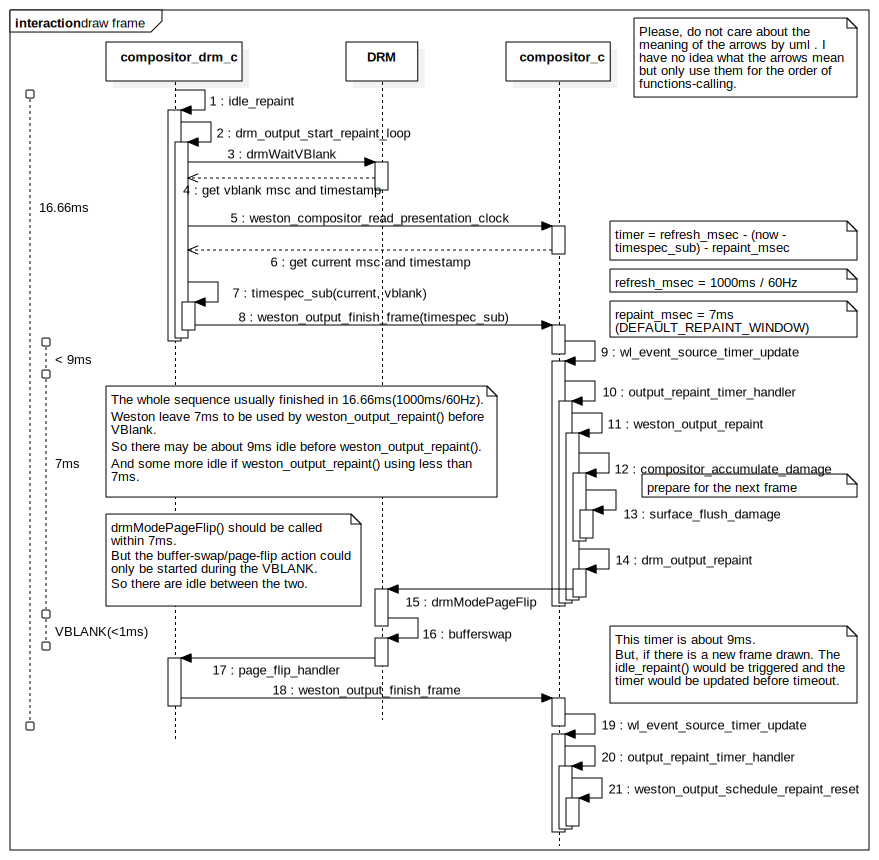

本文基于Weston-1.9.0整理完成。后续版本可能会有变动。但原理应该大同小异。
<!--break-->

基于DRM的Weston画面描画遵循一个原则：在两次场消隐中间的间隔时间内准备，然后在场消隐时提交。

按着60Hz的刷新率来说，两次场消隐的间隔时间为1000ms/60=16.66ms。

Weston默认画面的准备工作可以在最迟7ms内全部完成，所以它定义了一个宏叫做DEFAULT_REPAINT_WINDOW，这个宏定义的值是7ms（这样实际上会有不大于9ms的空闲，可以有效地避免Weston占用过高的CPU资源）。

当应用程序开始提交画面时（idle_repaint），Weston会计算下一次场消隐发生的时间，然后启动一个Timer。这个Timer会在下一次场消隐前7ms被触发。在这7ms内，Weston完成渲染工作，然后向DRM提交一个PageFlip触发。

当场消隐开始，DRM会处理之前提交上来的PageFlip事件，并在完成时回复给Weston。

