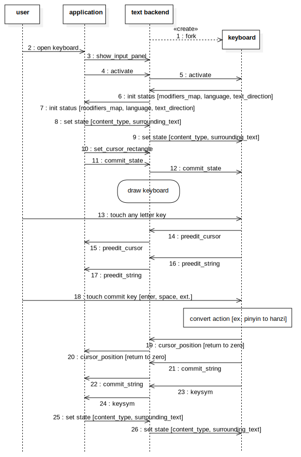
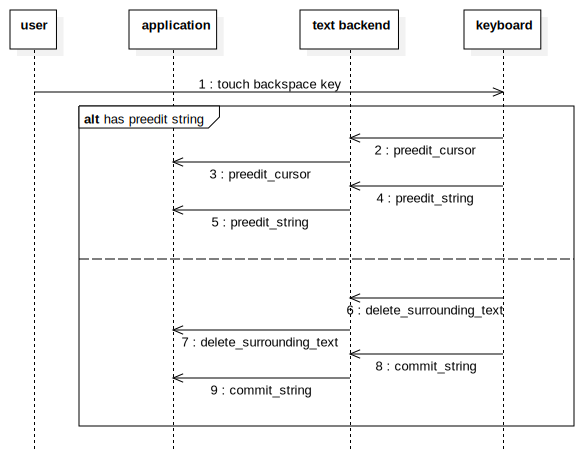

本文基于Weston-1.10.0整理完成。后续版本可能会有变动。但原理应该大同小异。
<!--break-->

**打开软键盘及输入文字的基本时序：**

软键盘在Weston启动时被text-backend的同步启动，并处于隐藏状态。

当应用程序的某个输入框获取到输入焦点时，会调用text-input协议的show_input_panel和activate这两个request来呼出软键盘。

软键盘被呼出之后，会向text-backend更新目前的基本状态，包括语种（language）信息等。这些信息会被转发给应用程序。应用程序根据这些信息决定可以直接使用还是需要重置软键盘状态。

如果应用程序要重置软键盘状态，需要使用text-input协议的一系列set request。例如使用set_preferred_language设置软键盘语种/类型。比如在全英文键盘、数字键盘、拨号盘、日文键盘等等状态下切换。

软键盘准备好之后，用户就可以通过点击案件向应用程序输入信息。此时，会同时更新光标位置和文字信息。这些信息都是未确认的信息（preedit string），通常是拼音字符。

当用户输入完拼音，并完成选字之后，软键盘调用input-method协议的commit_string request通知text-backend，并转发给应用程序。同时，会将光标位置归零。

通常，应用程序接收到正式的输入之后，会重新发送surround text等基本信息。

**删除字符时的基本时序：**

删除分两种情况。

如果用户输入还没有被确定，即存在preedit string，则删除动作在preedit string内部实现。软键盘直接发送删除动作结束之后的preedit string。

如果用户还没有开始输入或者已经完成了输入确认，即preedit string为空，则删除动作通过input-method协议的delete_surrounding_text这个request来实现。这个request直接通知应用程序从光标相对位置开始删除几个字符。

