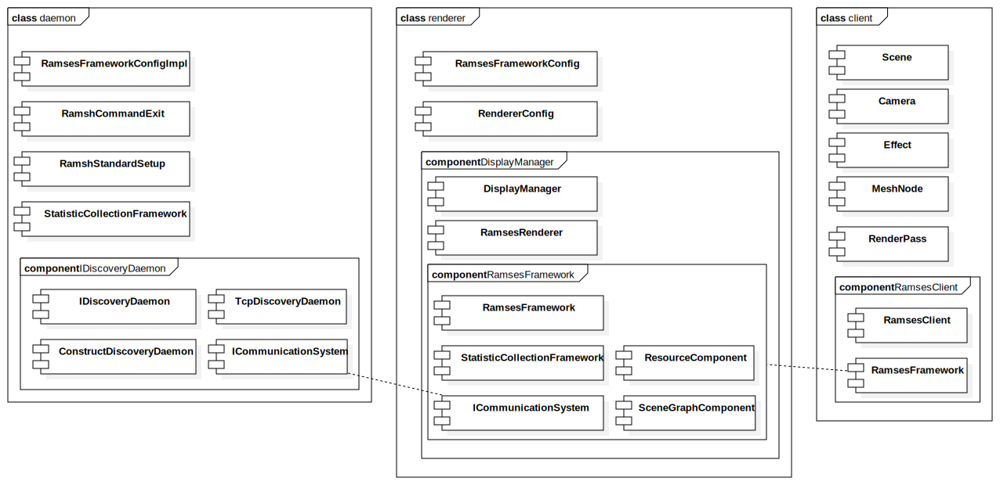

<!--break-->

# RAMSES-General

RAMSES consists of three fundamental components:

| component | description                              | comments                                 | 
| --------- | ---------------------------------------- | ---------------------------------------- | 
| daemon    | global address broker, exchanges connection info between clients and renderers in case the underlying communication is TCP | There can only be one daemon (when TCP communication is used), but arbitrary number of client and renderer instances. The daemon only "broadcasts" the existence of clients and renderers to each other (providers and consumers of scenes, respectively). | 
| client    | the instance creating 3D content         | Clients create scenes and manage their content, but cannot decide if and where a scene is shown (similar to a video stream which provides the video, but anyone can subscribe to it). | 
| renderer  | the instance which rasterizes images and shows them on displays | Renderers act as content consumers and can subscribe to scenes from clients and show them. Renderers can not change scene content, but can change where and how a scene is shown - for example can show two scenes in split screen, or blend one scene on top of another, in special cases can link data accross scenes. | 

(T.B.C.)

