以GENIVI官方的[E01HelloWorld](https://github.com/GENIVI/capicxx-core-tools/tree/master/CommonAPI-Examples/E01HelloWorld)为例。为了界面整洁性，后面使用X替换掉E01HelloWorld。

图中的Y表示Binding，可能是DBus，也可能是SomeIP，也可能是GENIVI新推出的Wamp，或者其他以后会推出的新东西。
<!--break-->

[TOC]

# Session : Init

## Common Sequence

### Server

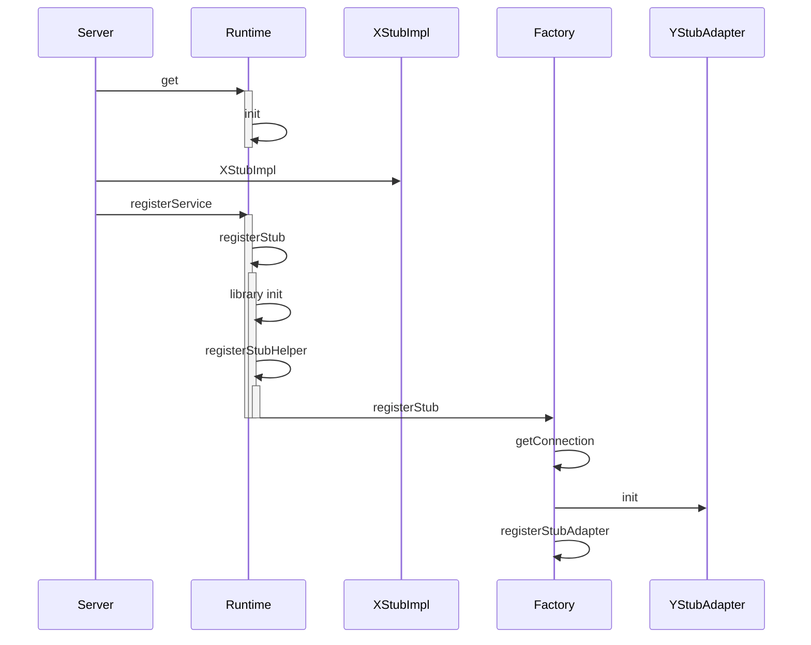

###Client

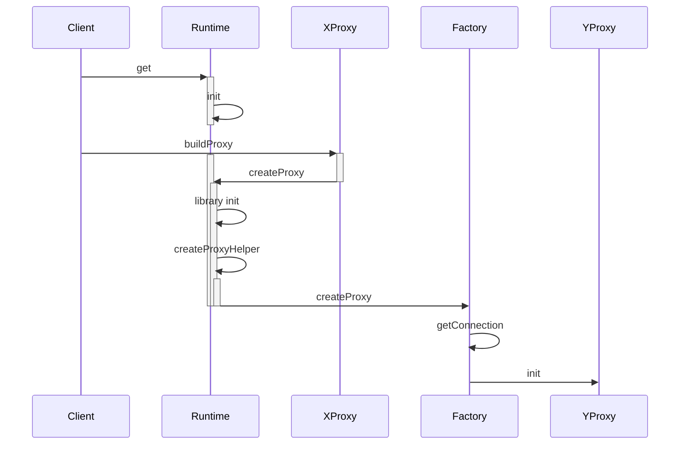

## Details

### Library Init

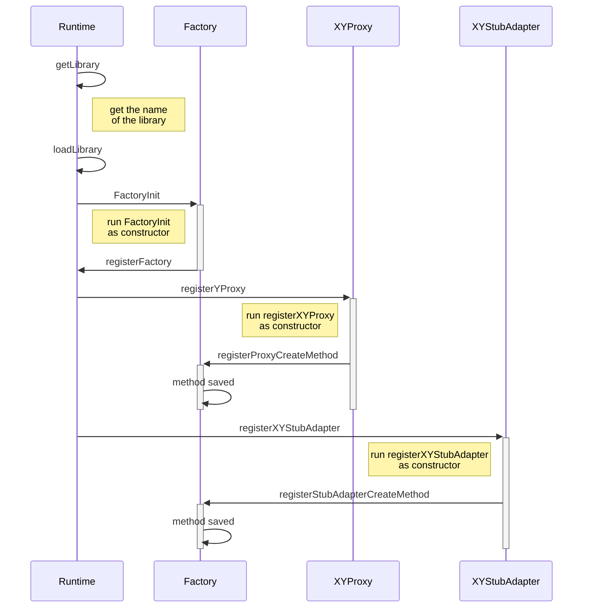

### Get Connection

#### SOME/IP

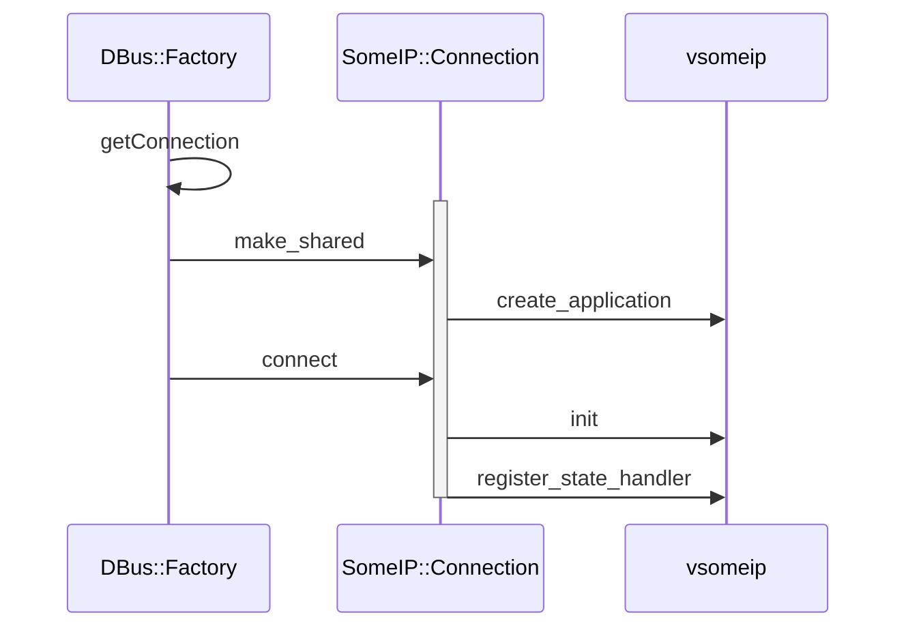

#### DBus

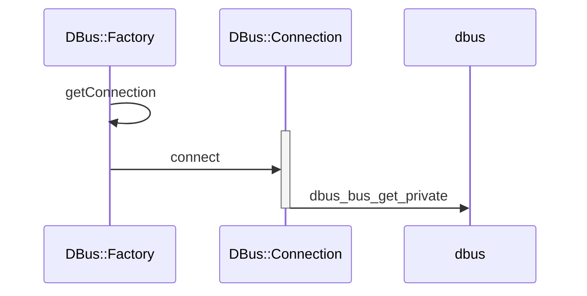

# Session : sayHello

## Common Sequence

### Client to Binding

客户端调用接口函数sayHello()发送请求：

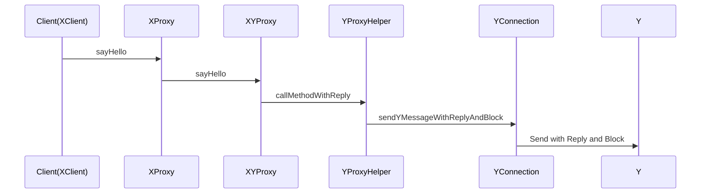

### Binding to Server

调用请求被通过Y转给了服务端：

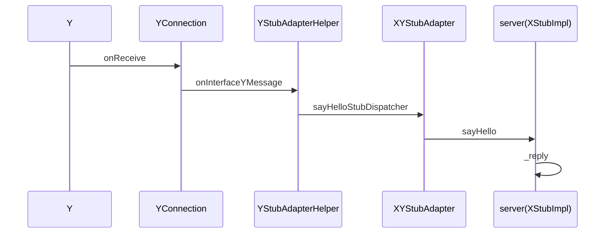

### Server back to Binding

服务端处理完请求之后，将结果送回给客户端：

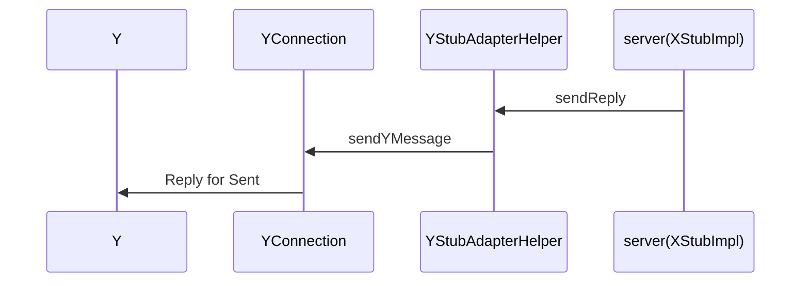

### Binding return to Client

最终，请求结果被通过dbus转回给客户端，通过函数参数返回，过程与第一个Sequence相逆，这里不再描画。

## Details

### Send with Reply and Block

#### DBus

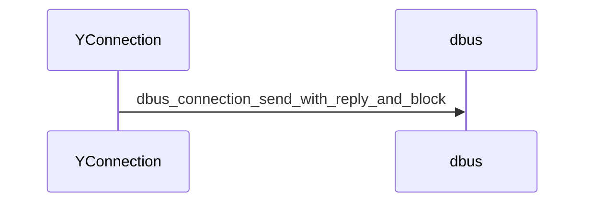

#### SOME/IP

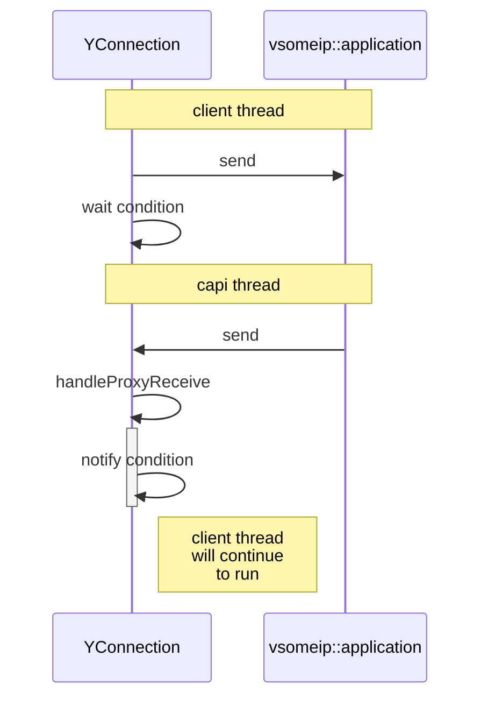

### On Receive

#### DBus

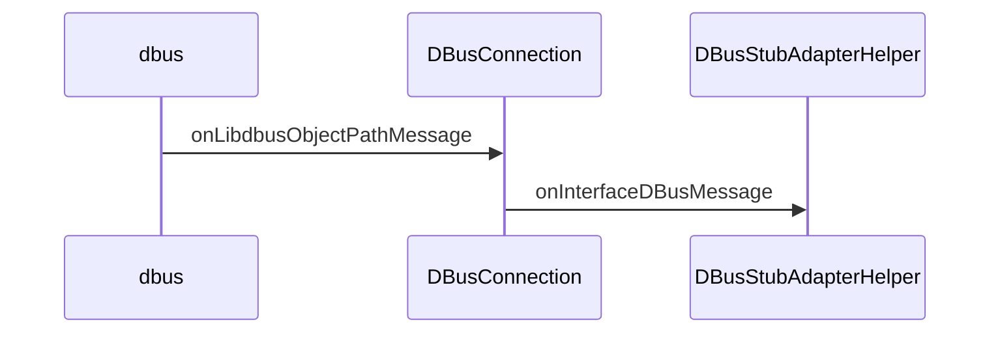

#### SOME/IP

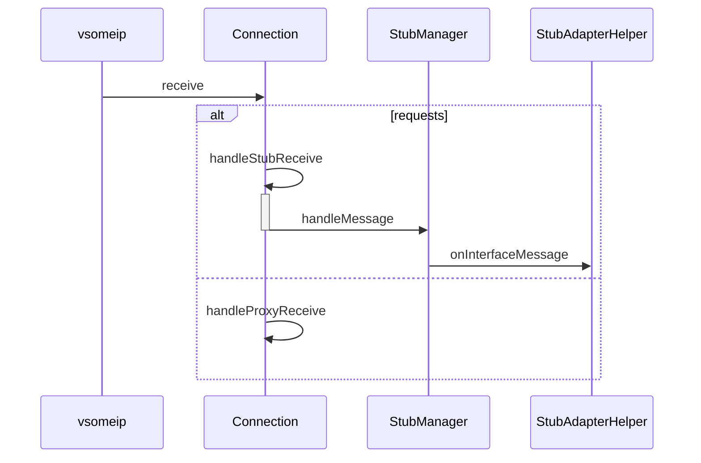

### Reply for Sent

#### DBus

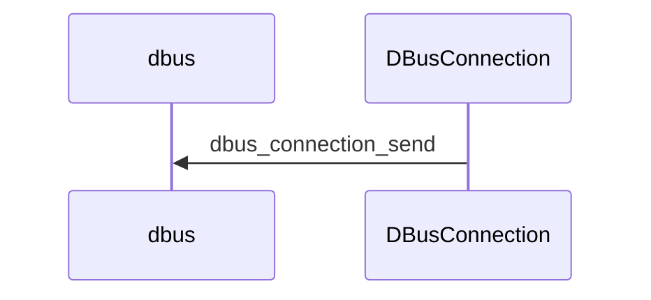

#### SOME/IP

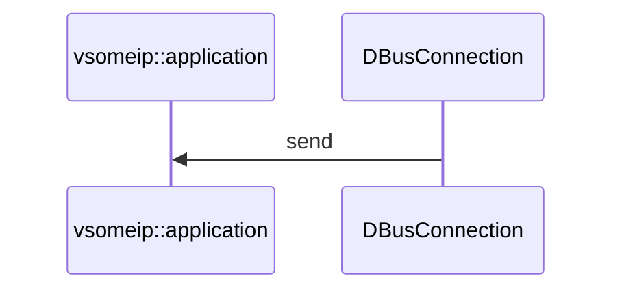

## Serialize

CommonAPI提供了一组类，InputStream和OutputStream，来实现数据的编串和解串。不同的Binding需要根据实际需求来封装这些类。

比如在SOME/IP中，对于各种不同数据类型的封装是有严格的说明的。所以在someip部分的代码的hpp和cpp文件中，就可以看到大量的代码用于实现这部分内容。

