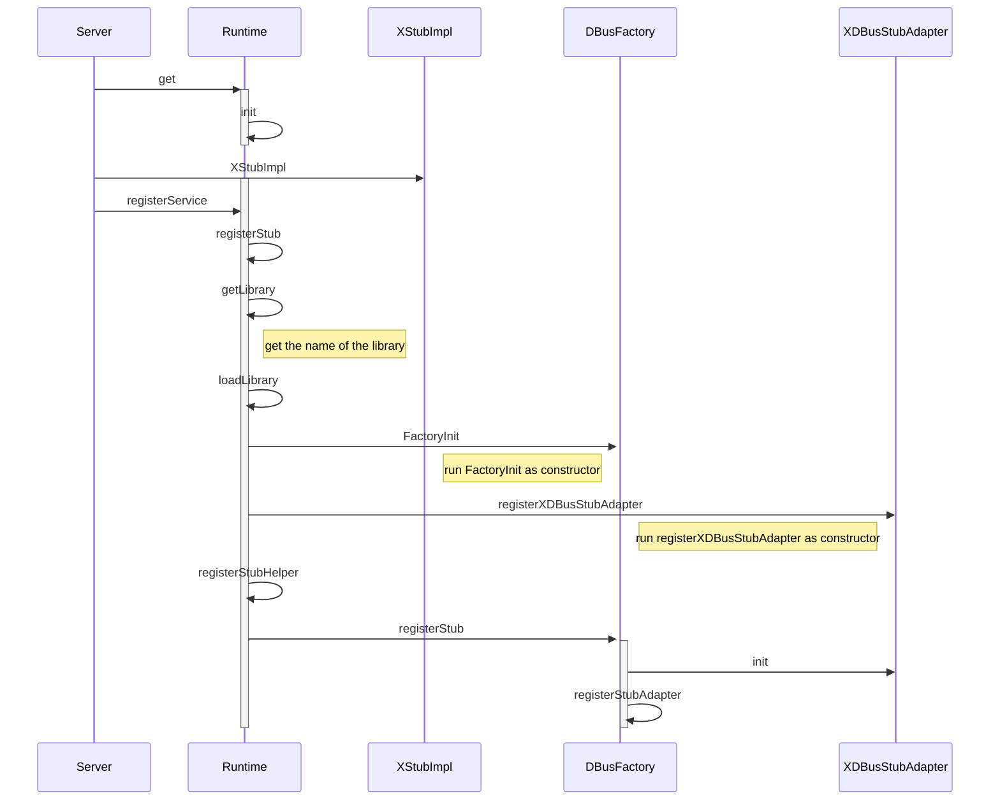
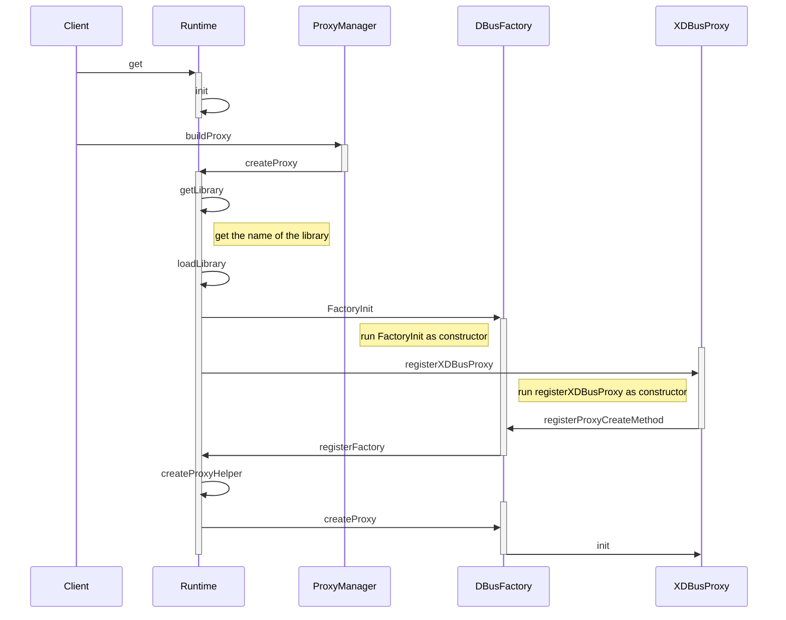
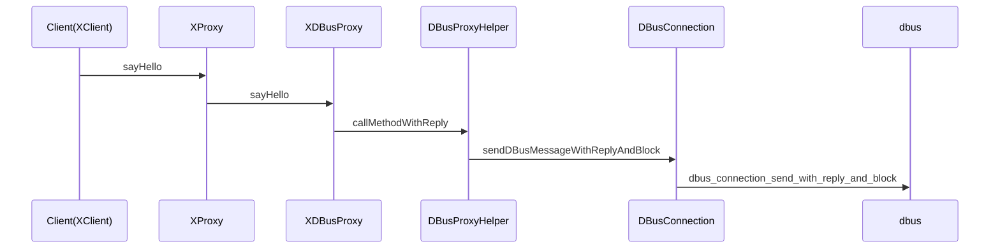
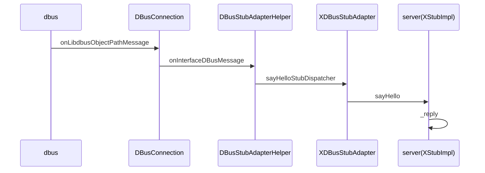
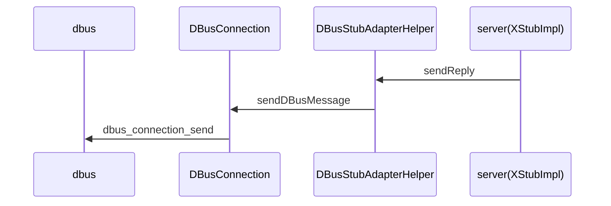

以GENIVI官方的[E01HelloWorld](https://github.com/GENIVI/capicxx-core-tools/tree/master/CommonAPI-Examples/E01HelloWorld)为例。

<!--break-->
（为了界面整洁性，后面使用X替换掉E01HelloWorld）

# Session : Server Init

# Session : Client Init

# Session : sayHello

客户端调用接口函数sayHello()发送请求：

调用请求被通过dbus转给了服务端：

服务端处理完请求之后，将结果送回给客户端：

最终，请求结果被通过dbus转回给客户端，通过函数参数返回，过程与第一个Sequence相逆，这里不再描画。
