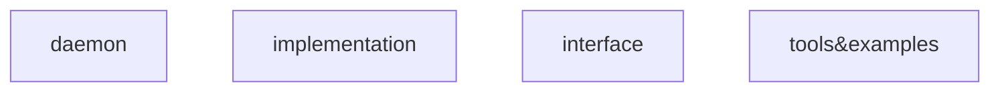
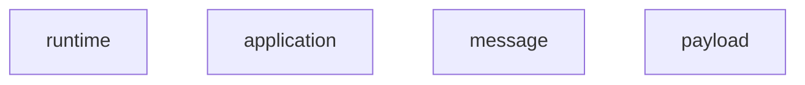
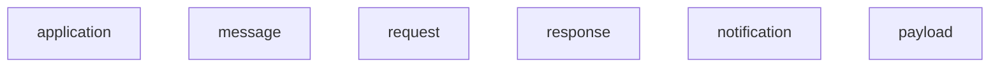
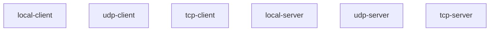
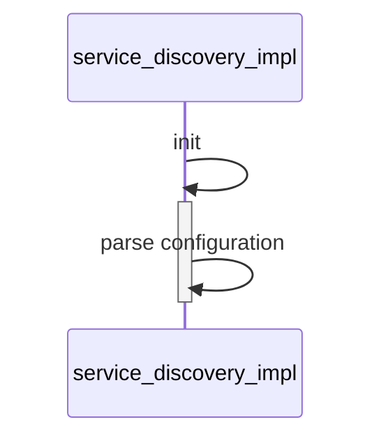
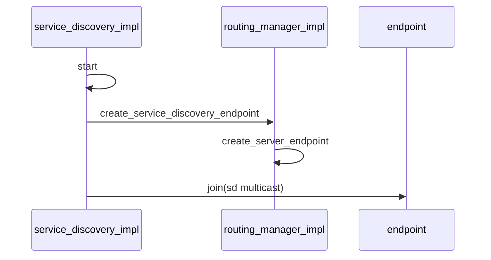
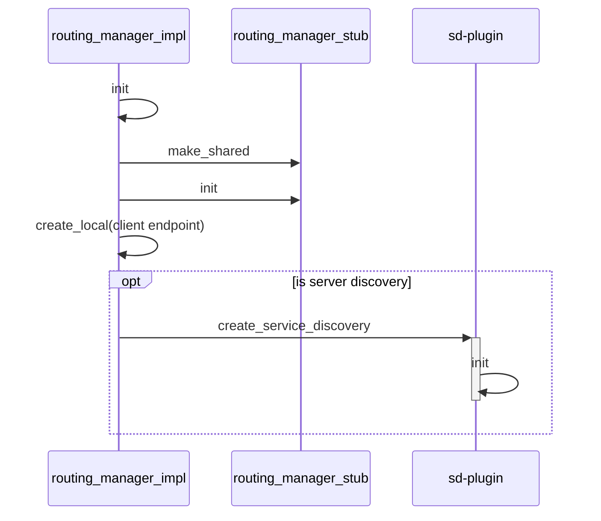
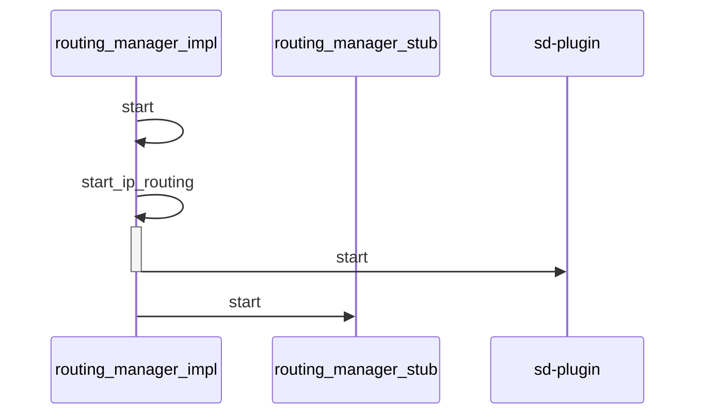
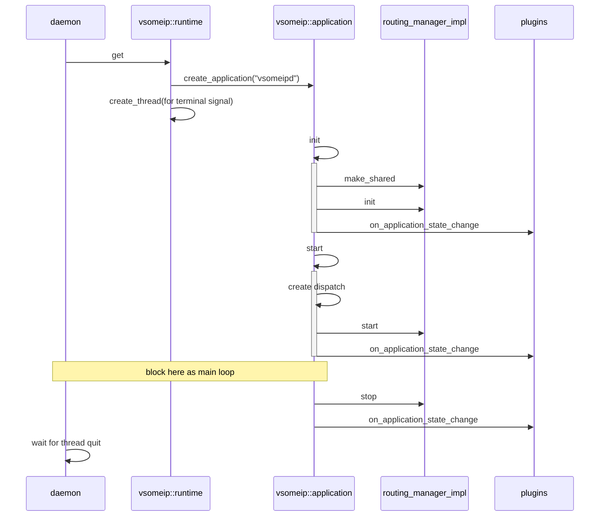

[vsomeip](https://github.com/GENIVI/vsomeip)是GENIVI提供的一个SOME/IP实现。

<!--break-->

# Block

vSomeIP的代码主要分成如下四大部分：



# Interface

interface由四部分组成：



## Runtime

这个类用于管理（主要是创建）其他所有公共资源和获取runtime属性。公共资源包括：



## Application

这是最核心的一个部分。它在每个客户端都存在且仅存在一份。Application可以通过Runtime的接口来实例化。他管理着vSomeIP客户端的生命周期和生命周期内的所有通讯。


### Plugin

vSomeIP允许Application加载一到多个Plugin。当Application的状态发生变化时，这个变化会被通知到Plugin。在通知的时候会附带Application的名称。用于Plugin进行区别对待。

Application的状态有三种，分别为：Initialized、Started、Stopped。


## Message

无论是Request、Response还是Notification，本质上都是一种Message。

从某种意义上来说，Message可以去分成两类，分别是通用Message和服务发现相关的Message。

Message类提供了编串和解串功能，用于进行数据通讯，本质上他封装了SOME/IP的消息头。所以，它还提供了一些列方法来设置或者读取详细的消息头信息。这一点可以参考SOME/IP的 [协议](https://www.autosar.org/fileadmin/user_upload/standards/classic/4-3/AUTOSAR_SWS_SOMEIPTransportProtocol.pdf) 文档。


## Payload

Message的主体。也就是排除消息头之后剩下的部分。


# Implementation

针对Interface的实装。 这里的内容中有些部分已经分布在其他章节，本处不再重述。只讨论前面没有提到的部分。

## Endpoints

每个具有vSomeIP功能的进程都是一个Endpoint。Endpoint分成分成六大类：



## Service Discovery

### Init



### Start




## Routing

每个系统中只能有一个vSomeIP服务被配置成Routing。

如果没有特别的设定，那么系统中被运行的第一个具备vSomeIP功能的程序会被作为Routing Manager。

### Init



### Start




# Daemon

daemon的主体就是一个vsomeip::application



上图可以看到，Application创建了一个routing_manager_impl的实例。如果这不是Daemon，而是一个通常的Application，那么他会转而创建routing_manager_proxy的实例，并与找到的Routing Manager建立连接。

# Tools & Examples

一些简易的Application。用于进行一些消息发送接收的测试工作。

```mermaid
sequenceDiagram
participant example
participant runtime as vsomeip::runtime
participant application as vsomeip::application
participant proxy as routing_manager_proxy
example ->> runtime : get
runtime ->> application : create_application()
example ->> +example : init
example ->> +application : init
application ->> proxy : make_shared
application ->> -proxy : init
example ->> application : register_state_handler
note over example,application : register a state handler to get called back after registration at the runtime was successful
example ->> application : register_message_handler
note over example,application : register a callback for responses from the service
example ->> -application : register_availability_handler
note over example,application : register a callback which is called as soon as the service is available
example ->> +example : start
example ->> application : start
opt has plugin
application ->> -plugins : on_application_state_change
end
application ->> +application : start
application ->> application : create dispatch
application ->> proxy : start
application ->> -plugins : on_application_state_change
note over example,application : block here as main loop
application ->> proxy : stop
opt has plugin
application ->> plugins : on_application_state_change
end
example ->> example : wait for thread quit
```


