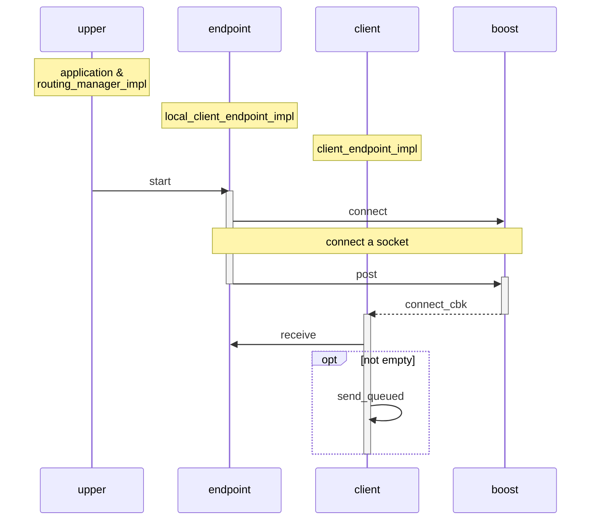
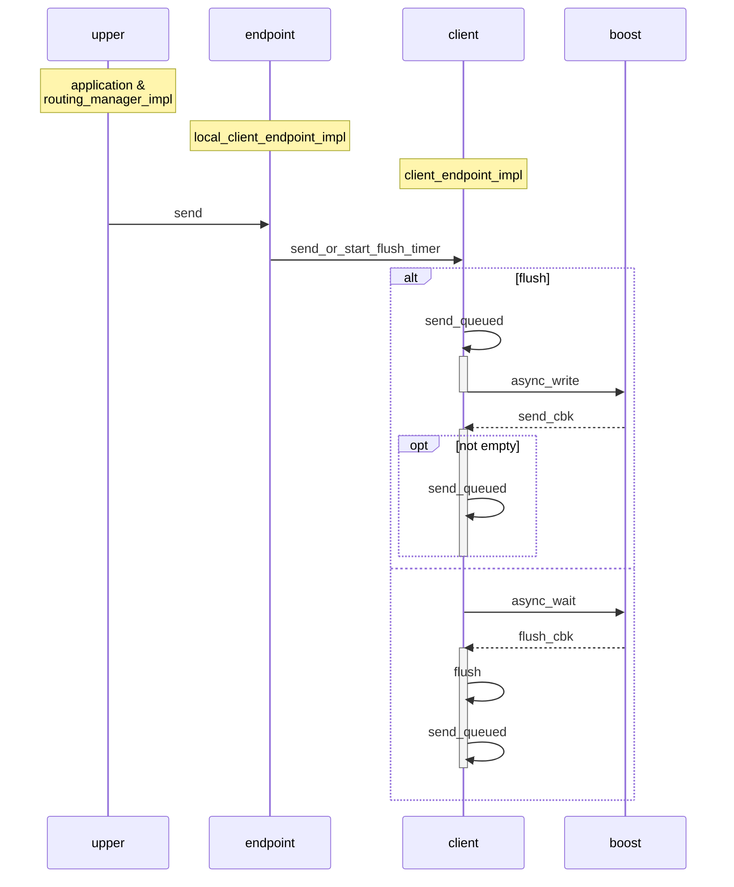
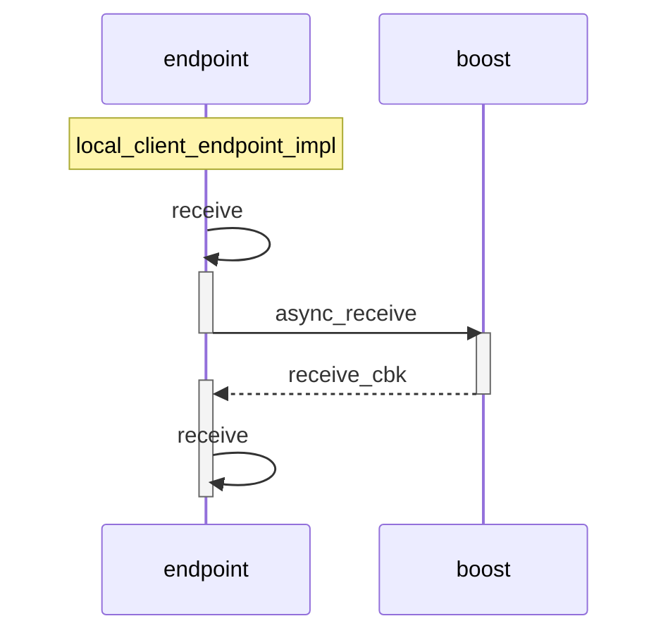
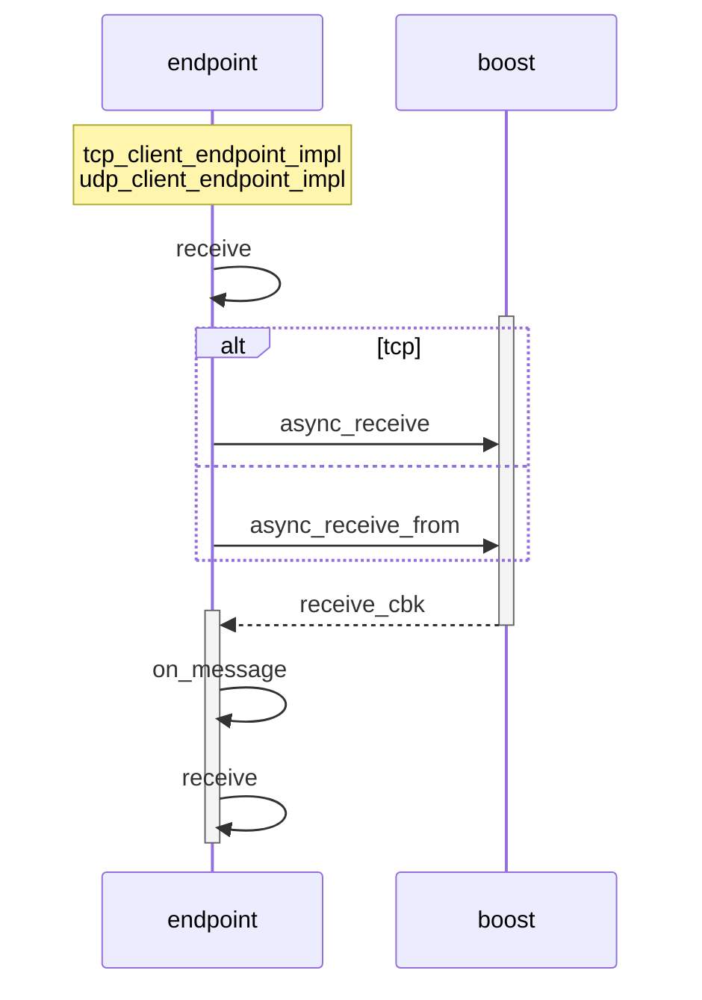

<!--break-->

#Menu

[TOC]

[End Point](https://github.com/GENIVI/vsomeip/blob/master/implementation/endpoints/include/endpoint.hpp)是所有vsomeip通讯实例的基础。

每个具有vSomeIP功能的进程都是一个Endpoint。Endpoint分成分成六大类：

# Concept

## Lifecycle

### Start

EndPoint的生命周期其实就是一个“连接”的生命周期。Start()函数中会根据EndPoint的类型创建一个Socket链接。并且开始触发第一次消息接收。

如果在连接建立起来之前，就已经有消息被放入队列中了。那么，在连接成功之后，会将队列中缓存的消息逐一发出。也就是说，vsomeip对于服务端和客户端启动的先后顺序没有强制要求，在这一点上包容性很强。

### Stop

Stop()的处理其实就是断开链接。这没什么可说的。唯一需要注意的就是，不同的EndPoint对于断开之前的处理可能有所不同。

比如client_endpoint_impl中封装的默认处理就是直接断开。但是local中封装的处理会等待Send队列中的数据全部发送完成。

此外，服务端的Stop()处理会逐一断开与客户端的连接，然后再关闭自己。

(T.B.C) 有时间的话，我会把所有类型的EndPoint逐一整理一遍。目前的信息都是随便挑着看的。

## Communication

每一种endpoint类型都对应了一组发送接收函数。

### Send

发送端的核心函数是send_queued()。无论是flush等于true的立刻发送，还是通常的发送，最后都会进入到这个函数中执行。

具体的消息发送接收是通过Boost.Asio[^asio]来实现的，绝大部分情况使用的都是[async_write()](https://www.boost.org/doc/libs/1_55_0/doc/html/boost_asio/reference/async_write/overload1.html)这个函数。他可以实现异步发送数据，并在发送完成或者失败之后调用回调函数。

vsomeip的开发者在每个send函数中都保留了debug用的log代码。只是使用#if 0屏蔽掉了。打开相应的代码可以进行数据级的调试工作。

### Send_to

区别于Send()函数，send_to()函数需要指定一个目标。所以，这个行为通常都是一个服务端行为。作为对比，我们可以看一下send()函数，里面是没有任何指向性的。说明每个客户端只针对一个服务端进行通讯。

### Receive

Receive()函数会在Start()函数中被激活，然后不停地通过回调重复激活。vsomeip基于boost的异步机制实现了一种类似循环体的调用模式。

## Others

### Magic Cookies

如果开启了Magic Cookie，则会在消息中插入一个固定的消息头。Client和Server的消息头不同。

这个功能仅对基于TCP的EndPoint有效。目前还不清楚引入这个消息头的目的是什么(T.B.C.)。

# Usage

## Local

在vsomeip中使用local模式时，没有明确的server和client的界线划分。这里的client更像是一个sender的概念，而server更像是一个receiver的概念。

也就是说，如果一个vsomeip的程序需要发送数据，比如request，那么它在这一刻就是client，会有一个client的实例存在。而当他需要接收数据，比如要接收Response或者Notification，那么这一刻他就是server，会有一个server的实例存在。

这一点和TCP/UDP是不同的，从client端的receive_cbk()函数的实现内容就可以明确的看出来。local的client端receive_cbk()函数几乎就是空的。但是TCP和UDP的client端的receive_cbk()函数都触发了on_message()的处理。

## TCP&UDP

(T.B.C.)

# Footnotes

[^asio]: [Boost.Asio](https://www.boost.org/doc/libs/1_55_0/doc/html/boost_asio.html) is a cross-platform C++ library for network and low-level I/O programming that provides developers with a consistent asynchronous model using a modern C++ approach.
