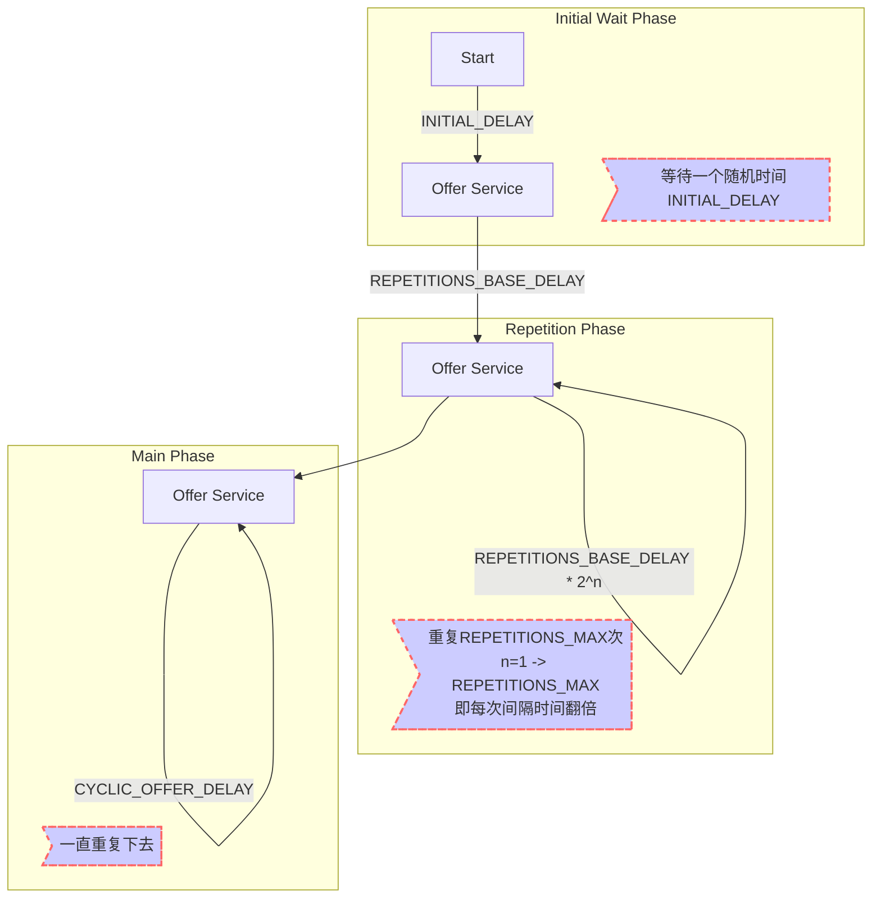
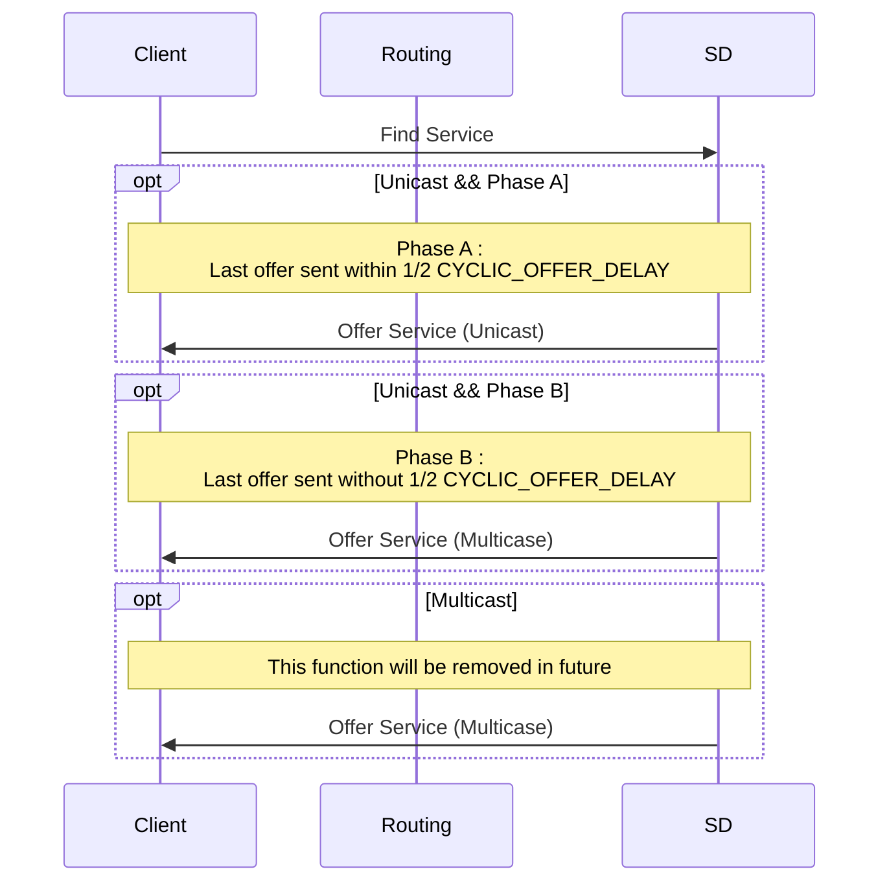

本文用于介绍SOME/IP-SD的Communication Behavior[^1]。

SOME/IP的Service Instance或者Event Group的启动过程可以分成三个阶段，分别是：Initial Wait Phase、Repetition Phase、Main Phase。

<!--break-->

# Behavior

## Startup

### Initial Wait Phase

一个Service Instance或者Event Group可以提供服务的前提条件是：这个Service依赖的所有组件已经就绪。包括但不限于一些用于数据收集的应用程序，一些硬件传感器等等。只有这些基础数据提供者全部就绪，这个Service Instance或者Event Group才能基于这些数据提供相应的服务。

为了确保基础服务就绪，SD（Service Discovery）会等待一个时间（INITIAL_DELAY），这个等待的阶段被称为Initial Wait Phase。

SOME/IP要求，SD并不直接使用这两个数值，而是获取一个介于最小值和最大值之间的随机值，作为INITIAL_DELAY来使用。这个随机值在SD启动时被确定下来，然后在后续所有需要使用的地方使用。

等待时间结束之后，SD会发送第一个Offer Service通知。

### Repetition Phase

在第一个Offer Service被发送之后，这个Service Instance或者Event Group将进入Repetition Phase阶段。

在这个阶段，SD会发送多个Offer Service通知。通知的个数取决于REPETITIONS_MAX的设定项。

在Repetition Phase阶段，发送Offer Service通知依然存在一个间隔时间。这个间隔时间由REPETITIONS_BASE_DELAY来决定。

时间从进入Repetition Phase开始计算。当到达REPETITIONS_BASE_DELAY时间之后，SD发送进入这个阶段之后的第一个Offer Service通知。

然后等待REPETITIONS_BASE_DELAY x2的时间，发送第二条，等待REPETITIONS_BASE_DELAY x4的时间发送第三条。每次发送的间隔都是翻倍的。直到发送的条数达到REPETITIONS_MAX的设定为止。

然后这个Service Instance或者Event Group将进入Main Phase阶段。

还有两种情况会导致这个Service Instance或者Event Group进入Main Phase。

如果REPETITIONS_MAX为0，则这个Service Instance或者Event Group会跳过Repetition Phase阶段直接进入Main Phase阶段。

或者在Repetition Phase阶段中接收到Find Serivce，也会导致这个Service Instance或者Event Group直接进入Main Phase阶段。

### Main Phase

在这个阶段，SD会以CYCLIC_OFFER_DELAY为间隔发送Offer Service通知。

### Flowchart

## Answer

### Delay

SD在接收到通过广播或者多播来发送的Find Service的Entry之后，不能立刻回复，而是要延迟一个时间REQUEST_RESPONSE_DELAY（如果是单播，则忽略REQUEST_RESPONSE_DELAY）。

与INITIAL_DELAY类似，REQUEST_RESPONSE_DELAY的配置也是通过一个最小值和一个最大值来进行的。使用时，获取这两个数值之间的一个随机值。

### Unicast & Multicasr

## Shutdown

当某个ECU的Service Instance被关闭时，应该发送一个Stop Offer Service通知。

收到Stop Offer Service 的Client不应该再次发送Find Service，除非收到了新的Offer Service。

如果Client被关闭了，SD应该发送Stop Subscribe Eventgroup通知。

如果ECU被关闭了，应该发送Stop Offer Service和Stop Subscribe Eventgroup的通知。

# Footnotes

[^1]: [Example for a Serialization Protocol (SOME/IP)](http://www.some-ip.com/papers/cache/AUTOSAR_TR_SomeIpExample_4.2.1.pdf) 6.7.5 Service Discovery Communication Behavior

