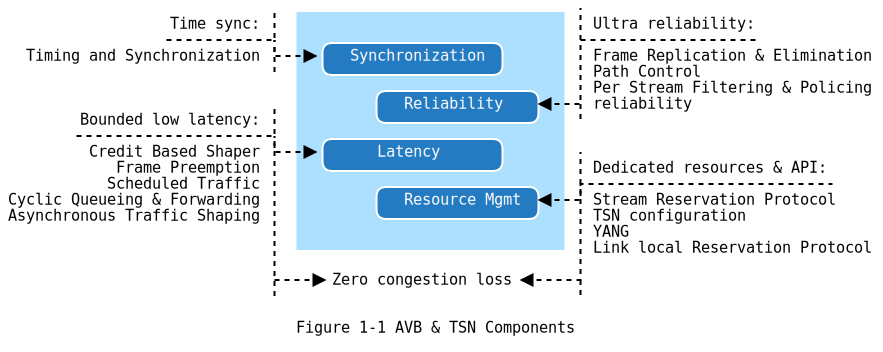

<!--break-->

图1中给出了目前一些引入到了时间敏感网络中的概念。其中有一些概念已经成熟，并作为标准协议在 IEEE 中进行了发布。有一些还是草案，正在被讨论。

* 时间同步（ Time sync ）：
  * 定时与同步（ Timing and Synchronization((IEEE Std 802.1AS - Timing and Synchronization)) ）

* 有限的低延迟（ Bounded low latency）：
  * 基于信用的整流（ Credit Based Shaper((IEEE Std 802.1Qav - Forwarding and Queuing of Time
Sensitive Streams (FQTSS) )) ）
  * 帧抢占（ Frame Preemption((IEEE Std 802.1Qbu - Frame Preemption)) ）
  * 规划传输（ Scheduled Traffic((IEEE Std 802.1Qbv - Enhancements for Scheduled Traffic)) ）
  * 周期性的队列与转发（ Cyclic Queueing & Forwarding((IEEE Std 802.1Qch - Cyclic Queueing & Forwarding)) ）
  * 异步传输整流（ Asynchronous Traffic Shaping((IEEE P802.1Qcr - Asynchronous Traffic Shaping)) ）

* 可靠性（ Ultra reliability ）：
  * 帧复制和消除（ Frame Replication & Elimination((IEEE P802.1CB - Frame Replication and Elimination for Reliability)) ）
  * 路径控制（ Path Control((IEEE Std 802.1Qca - IS IS Path Control and Reservation (PCR) )) ）
  * 以流为单位的过滤与策略（ Per Stream Filtering & Policing((IEEE Std 802.1Qci - Per Stream Filtering and Policing)) ）
  * 零拥塞损失（ Zero congestion loss((IEEE P802.1CB - Frame Replication and Elimination for Reliability)) ）

* 专有资源（ Dedicated resources & API ）
  * 流保留协议（ Stream Reservation Protocol((IEEE Std. 802.1Qat - Stream Reservation Protocol (SRP) )) ((IEEE P802.1Qcc - Stream Reservation Protocol (SRP) Enhancements
& Performance Improvements and TSN configuration)) ）
  * TSN 配置（ TSN configuration((IEEE P802.1Qcc - Stream Reservation Protocol (SRP) Enhancements
& Performance Improvements and TSN configuration)) ）
  * YANG 数据模型（ YANG((IEEE P802.1Qcp - YANG Data Model)) ）
  * 本地连接预留协议（ Link local Reservation Protocol((IEEE P802.1CS - Link local Registration Protocol (LRP) )) ）
