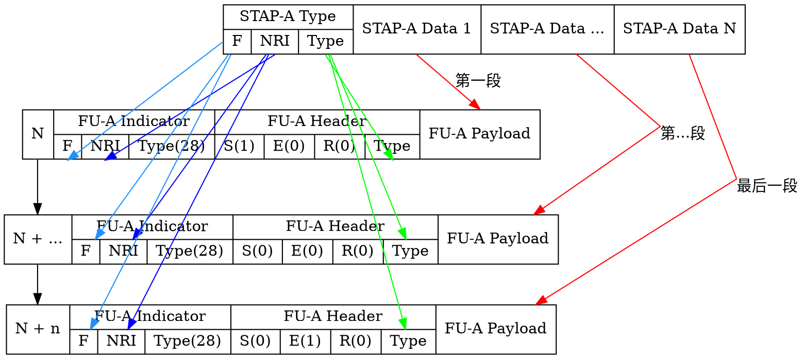

<!--break-->

```graphviz
digraph "STAP-A -> FU-A" {
    node [shape=record];
    graph [ splines = line ];
    SA  [label="{STAP-A Type
              | {<f> F |<n> NRI |<t> Type } }
              | {<d1> STAP-A Data 1}
              | {<dx> STAP-A Data ...}
              | {<dn> STAP-A Data N}"
        ];
    FU  [label="{<i> N}| {FU-A Indicator | {<f> F |<n> NRI | Type(28) } } | {FU-A Header | {<s> S(1) | E(0) | R(0) | <t> Type } }| {<p> FU-A Payload}"];
    FUx [label="{<i> N + ...} | {FU-A Indicator | {<f> F |<n> NRI | Type(28) } } | {FU-A Header | {S(0) | E(0) | R(0) | <t> Type } } | {<p> FU-A Payload}"];
    FUn [label="{<i> N + n} | {FU-A Indicator | {<f> F |<n> NRI | Type(28) } } | {FU-A Header | {S(0) |<e> E(1) | R(0) | <t> Type } } | {<p> FU-A Payload}"];
    FU:i -> FUx:i;
    FUx:i -> FUn:i;
    SA:f -> FU:f [color="DodgerBlue" ];
    SA:f -> FUx:f [color="DodgerBlue" ];
    SA:f -> FUn:f [color="DodgerBlue" ];
    SA:n -> FU:n [color="Blue" ];
    SA:n -> FUx:n [color="Blue" ];
    SA:n -> FUn:n [color="Blue" ];
    SA:t -> FU:t [color="Green" ];
    SA:t -> FUx:t [color="Green" ];
    SA:t -> FUn:t [color="Green" ];
    SA:d1 -> FU:p [label="第一段" color="Red" ];
    SA:dx -> FUx:p [label="第...段" color="Red" ];
    SA:dn -> FUn:p [label="最后一段" color="Red" ];
}
```
