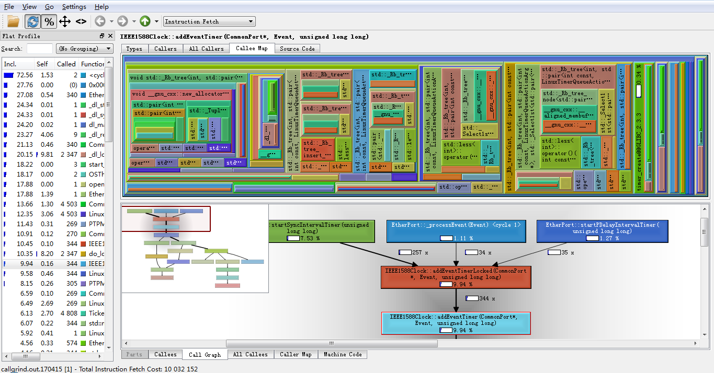

<!--break-->

首先使用如下命令运行目标程序：

```
valgrind --tool=callgrind ./a.out

```

运行结束之后，会在当前目录下生成一个callgrind.out.<PID>的文件。

此时，有两个选择：

1、生成静态图片：

```bash
$ gprof2dot  -f callgrind  -s callgrind.out.<PID> > valgrind.dot
$ dot -Tpng valgrind.dot -o valgrind.png
```

如果系统上没有dot和gprof2dot，可以通过一下方式安装：

```bash
$ apt-get install python3 graphviz
$ pip3 install gprof2dot

```

2、使用GUI工具查看：

在Windows下，可以使用[QCacheGrind](https://sourceforge.net/projects/qcachegrindwin/)打开生成的文件。Linux下则可以使用KCacheGrind（我没用过）。

网络上提到可以通过gprof2dot来将这个out文件转换成png图片，但是我尝试过，发现效果并不理想。

下图是一个使用callgrind分析gptp运行时调用堆栈的例子：



从方便性的角度来说，使用GUI的方式会更佳易于操作。因为在GUI工具中可以选择具体展开某个调用细节。
而使用图片的话，就得自己拖来拖去的查找了——对于复杂的应用程序来说，这个图片会非常的大。
