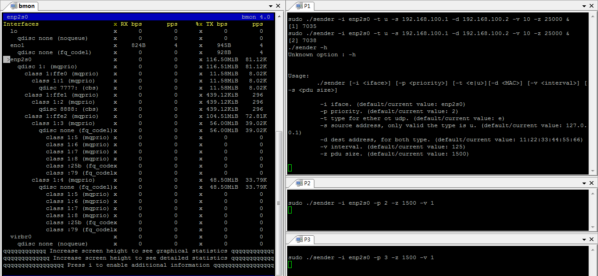

在AVB网络中，流预留是一个很重要的、用来保证数据流的时效性的技术手段。
它通过在整个网络中的各个节点上进行带宽预留的方式来确保数据流发送过程中不会由于带宽不足而导致传输不及时。

<!--break-->

为了实现这个目的，IEEE引入了SRP（即802.1Qat）协议来通知整个网络路径上的各个节点，
让每个节点知道自己应该预留多少带宽，以及汇报自身的带宽是否还足够预留。

但是，SRP协议并没有描述各个节点应该如何来实现带宽预留这个动作。这件事情需要各个节点自行完成。

AVB 网络中的节点主要分成三大类：Talker节点、桥节点、Listener节点。
由于流预留针对的是出口带宽，因此，前两者都需要考虑流预留的问题。本文仅讨论其中的Talker节点。

经测试，我发现，至少在Linux系统下，CBS协议自身就可以很好的实现流预留。

首先，我在不对网卡队列进行任何设置的情况下测试满负荷发送UDP数据。结果是最大发送速率为117.34MiB左右。

接下来，根据Avnu给出的[例子](https://tsn.readthedocs.io/qdiscs.html)进行网络配置。

```bash
sudo tc qdisc add dev enp2s0 parent root handle 1 mqprio \
        num_tc 3 \
        map 2 2 1 0 2 2 2 2 2 2 2 2 2 2 2 2 \
        queues 1@0 1@1 2@2 \
        hw 0
sudo tc qdisc replace dev enp2s0 parent 1:1 cbs \
        idleslope 98688 sendslope -901312 hicredit 153 locredit -1389 \
        offload 1

sudo tc qdisc replace dev enp2s0 parent 1:2 cbs \
        idleslope 3648 sendslope -996352 hicredit 12 locredit -113 \
        offload 1
```

然后运行两个测试程序，通过通常的UDP报文发送非时间敏感数据。
这个时候通过[bmon](https://linux.die.net/man/1/bmon)软件监控带宽，
可以看到，两个程序都在以58.35MiB左右的速率发送数据（我不确定为什么它们的和会小于117.34MiB）。

最后运行两个测试程序，分别基于优先级2和优先级3模拟发送时间敏感数据，
参照下图，可以看到。其中一个UDP测试程序的速率降低，让出了CBS预留的带宽。
Queue0(Class 1:1)和Queue1(Class 2:2)的预计的带宽得到了保证。



这个时候，如果调低时间敏感程序的数据发送量，可以看到，非时间敏感数据可用的带宽并没有变化。
虽然时间敏感程序不再使用相应的带宽，但是，这部分带宽还是会被预留而不会被非时间敏感程序占用。
猜测，这样做的好处是，避免了反复调整带宽而引入的延迟。

补充：
这里留下了一个问题。当没有设置tc的时候，一个通常的UDP程序可以使用一个Queue满负荷发送数据。
但是，当设置了tc之后，单个的UDP程序最大只能使用58MiB的带宽了。
这是不正常的，需要进一步调查产生这个问题的原因。
