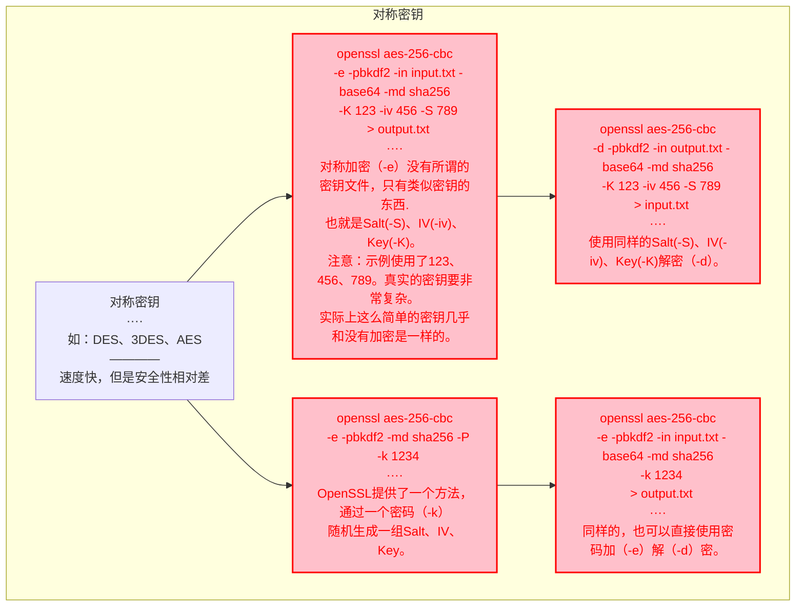
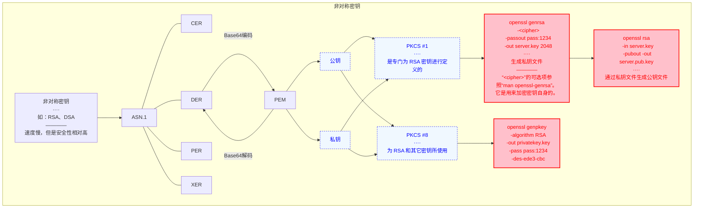
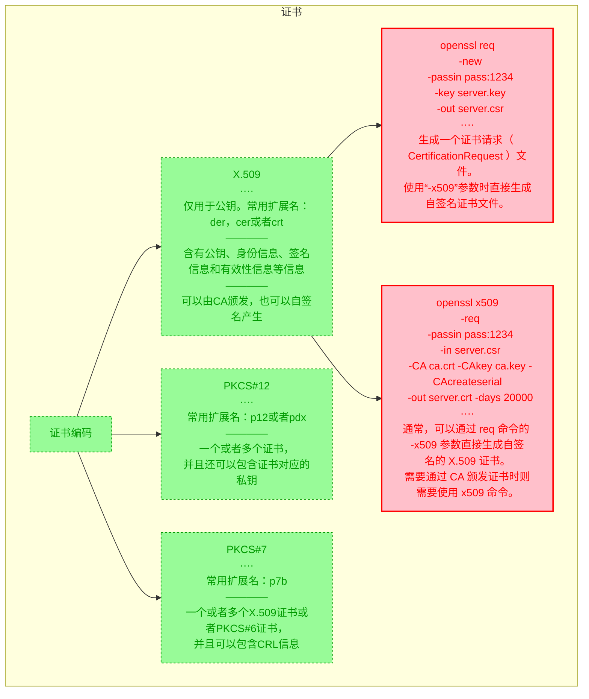
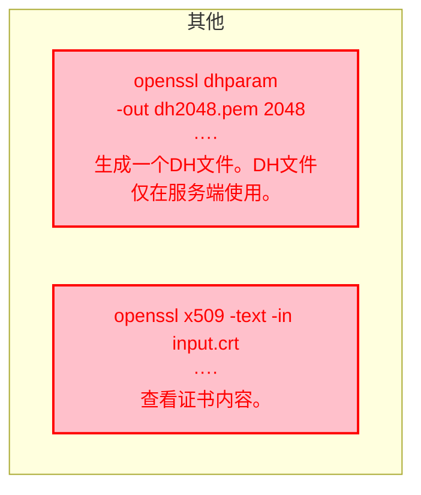

简单总结一下密钥、证书，以及如何通过OpenSSL生成密钥和证书。

<!--break-->

## 密钥

```mermaid
flowchart TB
    subgraph key["对称密钥"]
        symKey["对称密钥<br/>····<br/>如：DES、3DES、AES<br/>————<br/>速度快，但是安全性相对差"]
        os_enc_key["openssl aes-256-cbc<br/>&nbsp;&nbsp;-e -pbkdf2 -in input.txt -base64 -md sha256<br/>&nbsp;&nbsp;-K 123 -iv 456 -S 789<br/>&nbsp;&nbsp;&gt; output.txt<br/>····<br/>对称加密（-e）没有所谓的密钥文件，只有类似密钥的东西.<br/>也就是Salt(-S)、IV(-iv)、Key(-K)。<br/>注意：示例使用了123、456、789。真实的密钥要非常复杂。<br/>实际上这么简单的密钥几乎和没有加密是一样的。"]
        os_dec_key["openssl aes-256-cbc<br/>&nbsp;&nbsp;-d -pbkdf2 -in output.txt -base64 -md sha256<br/>&nbsp;&nbsp;-K 123 -iv 456 -S 789<br/>&nbsp;&nbsp;&gt; input.txt<br/>····<br/>使用同样的Salt(-S)、IV(-iv)、Key(-K)解密（-d）。"]
        os_enc_p2k["openssl aes-256-cbc<br/>&nbsp;&nbsp;-e -pbkdf2 -md sha256 -P<br/>&nbsp;&nbsp;-k 1234<br/>····<br/>OpenSSL提供了一个方法，通过一个密码（-k）<br/>随机生成一组Salt、IV、Key。"]
        os_enc_ps["openssl aes-256-cbc<br/>&nbsp;&nbsp;-e -pbkdf2 -in input.txt -base64 -md sha256<br/>&nbsp;&nbsp;-k 1234<br/>&nbsp;&nbsp;&gt; output.txt<br/>····<br/>同样的，也可以直接使用密码加（-e）解（-d）密。"]
    end
    symKey --> os_enc_key
    os_enc_key --> os_dec_key
    symKey --> os_enc_p2k
    os_enc_p2k --> os_enc_ps
    style os_enc_key fill:#ffc0cb,stroke:#f00,stroke-width:2px,color:#f00
    style os_dec_key fill:#ffc0cb,stroke:#f00,stroke-width:2px,color:#f00
    style os_enc_p2k fill:#ffc0cb,stroke:#f00,stroke-width:2px,color:#f00
    style os_enc_ps fill:#ffc0cb,stroke:#f00,stroke-width:2px,color:#f00
```

```mermaid
flowchart TB
    subgraph key["非对称密钥"]
        ASN1["ASN.1"]
        CER["CER"]
        DER["DER"]
        PER["PER"]
        XER["XER"]
        PEM["PEM"]
        asymKey["非对称密钥<br/>····<br/>如：RSA、DSA<br/>————<br/>速度慢，但是安全性相对高"]
        pubKey["公钥"]
        privKey["私钥"]
        p1["PKCS #1<br/>····<br/>是专门为 RSA 密钥进行定义的"]
        p8["PKCS #8<br/>····<br/>为 RSA 和其它密钥所使用"]
        os_rsa["openssl genrsa<br/>&nbsp;&nbsp;-&lt;cipher&gt;<br/>&nbsp;&nbsp;-passout pass:1234<br/>&nbsp;&nbsp;-out server.key 2048<br/>····<br/>生成私钥文件<br/>————<br/>“&lt;cipher&gt;”的可选项参照“man openssl-genrsa”。<br/>它是用来加密密钥自身的。"]
        os_rsa_pub["openssl rsa<br/>&nbsp;&nbsp;-in server.key<br/>&nbsp;&nbsp;-pubout -out server.pub.key<br/>····<br/>通过私钥文件生成公钥文件"]
        os_key["openssl genpkey<br/>&nbsp;&nbsp;-algorithm RSA<br/>&nbsp;&nbsp;-out privatekey.key<br/>&nbsp;&nbsp;-pass pass:1234<br/>&nbsp;&nbsp;-des-ede3-cbc"]
    end
    asymKey --> ASN1
    ASN1 --- CER
    ASN1 --- DER
    ASN1 --- PER
    ASN1 --- XER
    DER -->|Base64编码| PEM
    PEM -->|Base64解码| DER
    PEM --> pubKey
    pubKey --> p1
    pubKey --> p8
    PEM --> privKey
    privKey --> p1
    privKey --> p8
    p1 --> os_rsa
    os_rsa --> os_rsa_pub
    p8 --> os_key
    style pubKey fill:#f0f8ff,stroke:#00f,stroke-dasharray:3 3,color:#00f
    style privKey fill:#f0f8ff,stroke:#00f,stroke-dasharray:3 3,color:#00f
    style p1 fill:#f0f8ff,stroke:#00f,stroke-dasharray:3 3,color:#00f
    style p8 fill:#f0f8ff,stroke:#00f,stroke-dasharray:3 3,color:#00f
    style os_rsa fill:#ffc0cb,stroke:#f00,stroke-width:2px,color:#f00
    style os_rsa_pub fill:#ffc0cb,stroke:#f00,stroke-width:2px,color:#f00
    style os_key fill:#ffc0cb,stroke:#f00,stroke-width:2px,color:#f00
```

## 证书

```mermaid
flowchart TB
    subgraph cert["证书"]
        CERT["证书编码"]
        x509["X.509<br/>····<br/>仅用于公钥。常用扩展名：der，cer或者crt<br/>————<br/>含有公钥、身份信息、签名信息和有效性信息等信息<br/>————<br/>可以由CA颁发，也可以自签名产生"]
        p7b["PKCS#7<br/>····<br/>常用扩展名：p7b<br/>————<br/>一个或者多个X.509证书或者PKCS#6证书，<br/>并且可以包含CRL信息"]
        p12["PKCS#12<br/>····<br/>常用扩展名：p12或者pdx<br/>————<br/>一个或者多个证书，<br/>并且还可以包含证书对应的私钥"]
        os_req["openssl req<br/>&nbsp;&nbsp;-new<br/>&nbsp;&nbsp;-passin pass:1234<br/>&nbsp;&nbsp;-key server.key<br/>&nbsp;&nbsp;-out server.csr<br/>····<br/>生成一个证书请求（ CertificationRequest ）文件。<br/>使用“-x509”参数时直接生成自签名证书文件。"]
        os_x509["openssl x509<br/>&nbsp;&nbsp;-req<br/>&nbsp;&nbsp;-passin pass:1234<br/>&nbsp;&nbsp;-in server.csr<br/>&nbsp;&nbsp;-CA ca.crt -CAkey ca.key -CAcreateserial<br/>&nbsp;&nbsp;-out server.crt -days 20000<br/>····<br/>通常，可以通过 req 命令的 -x509 参数直接生成自签<br/>名的 X.509 证书。<br/>需要通过 CA 颁发证书时则需要使用 x509 命令。"]
    end
    CERT --> x509
    CERT --> p12
    CERT --> p7b
    x509 --> os_req
    x509 --> os_x509
    style CERT fill:#98fb98,stroke:#090,stroke-dasharray:3 3,color:#090
    style x509 fill:#98fb98,stroke:#090,stroke-dasharray:3 3,color:#090
    style p7b fill:#98fb98,stroke:#090,stroke-dasharray:3 3,color:#090
    style p12 fill:#98fb98,stroke:#090,stroke-dasharray:3 3,color:#090
    style os_req fill:#ffc0cb,stroke:#f00,stroke-width:2px,color:#f00
    style os_x509 fill:#ffc0cb,stroke:#f00,stroke-width:2px,color:#f00
```

## 其他

```mermaid
flowchart TB
    subgraph others["其他"]
        os_dh["openssl dhparam<br/>&nbsp;&nbsp;-out dh2048.pem 2048<br/>····<br/>生成一个DH文件。DH文件仅在服务端使用。"]
        os_show["openssl x509 -text -in input.crt<br/>····<br/>查看证书内容。"]
    end
    style os_dh fill:#ffc0cb,stroke:#f00,stroke-width:2px,color:#f00
    style os_show fill:#ffc0cb,stroke:#f00,stroke-width:2px,color:#f00
```

```mermaid
classDiagram
    class ASN_1["ASN.1"] {
        <<Abstract Syntax Notation One>>
    }
    class CER["CER"] {
        <<Canonical Encoding Rules>>
        规范编码规则
    }
    class DER["DER"] {
        <<Distinguished Encoding Rules>>
        唯一编码规则
    }
    class PER["PER"] {
        <<Packed Encoding Rules>>
        压缩编码规则
    }
    class XER["XER"] {
        <<XML Encoding Rules>>
        XML编码规则
    }
    class PKCS["PKCS"] {
        <<Private-Key Information Syntax Standard>>
    }
    class PEM["PEM"] {
        <<Privacy Enhanced Mail>>
        隐私增强邮件
    }
    class AES["AES"] {
        <<Advanced Encryption Standard>>
    }
    class DES["DES"] {
        <<Data Encryption Standard>>
    }
    class DES3["3DES"] {
        <<Triple Data Encryption Algorithm>>
    }
```

## 参照

[PEM 的 Label 值](https://www.rfc-editor.org/rfc/rfc7468#section-4)
