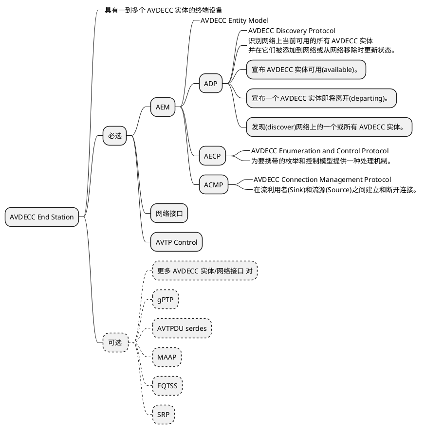
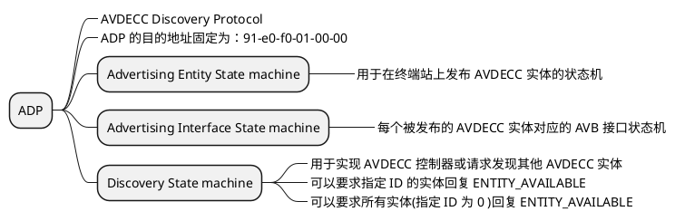
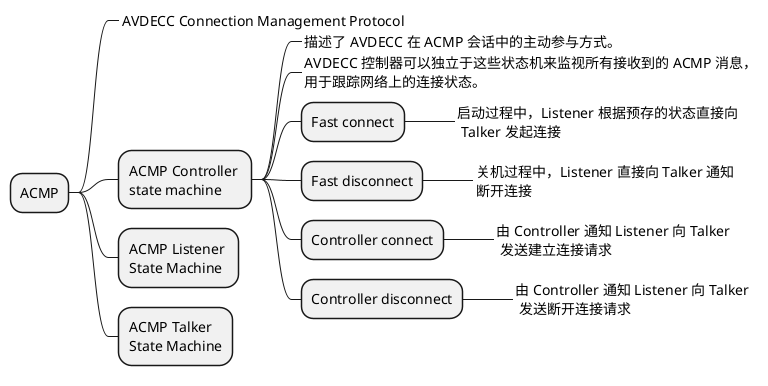
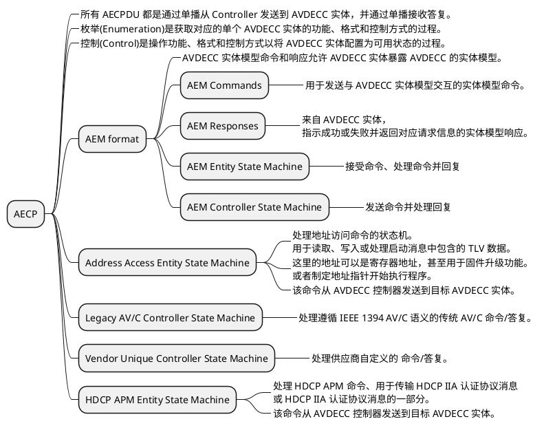
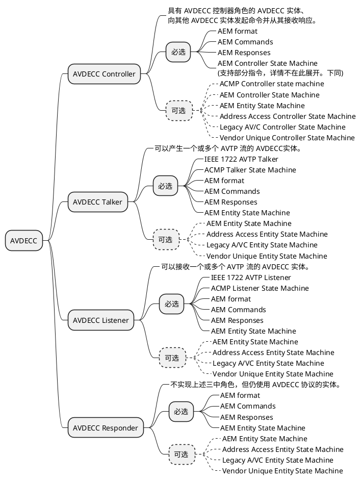

<!--break-->

# AVDECC 实体

从更宏观的角度，以设备实体为单位，一个 AVDECC 设备需要包含以下的功能组件。

## ADP

用于使 AVDECC 实体发现其他实体及被其他实体发现的机制。
ADP 报文的发送形式为多播。

当足够多的 ADP 报文于网络上流转之后，所有 AVDECC 终端都可以找到自己期望的另一个
终端。

## ACMP

根据前文所述，每一个 AVDECC 实体中都必然包涵 ACMP 功能。
当终端通过 ADP 报文找到期望的、对应的 AVDECC 终端之后，就可以通过 ACMP 报文发起连接。
这个连接动作可能是预设的，也可能是用户手动操作而触发的。

## AECP

# AVDECC 角色

从功能角度， AVDECC 可以分成如下四种功能角色：

