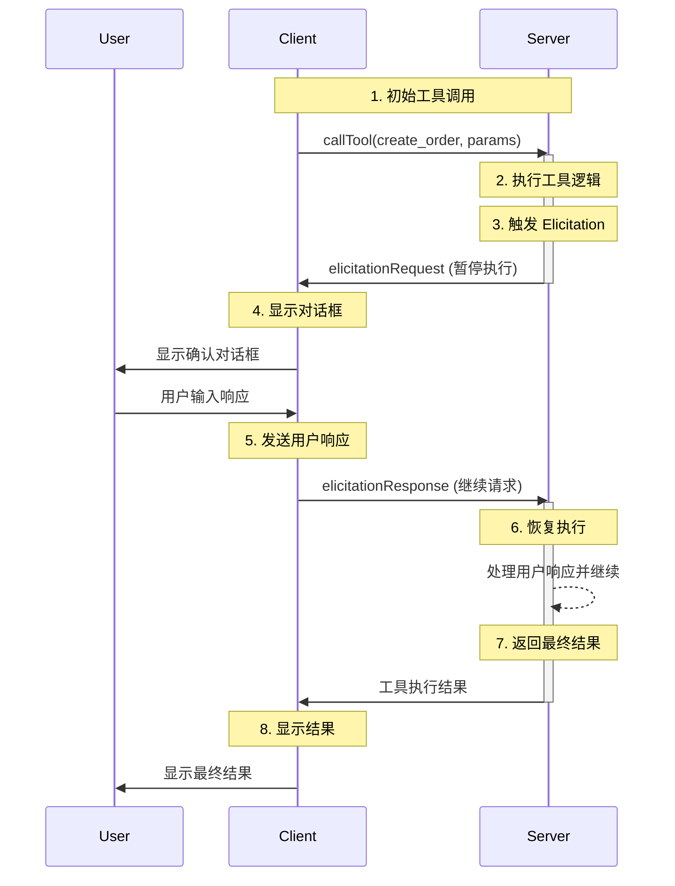

`Elicitation`的具体介绍可以参照`MCP`的[规范文档](https://modelcontextprotocol.io/specification/2025-06-18/client/elicitation)。
该功能允许 `MCP` 服务器在工具执行过程中暂停，并通过客户端向用户请求额外的输入信息，非常适合处理需要人工介入或确认的场景。

<!--break-->

`Elicitation`的流程示意如下：




## 示例程序

### 服务端

在`my_tool`运行过程中，调用`ctx.elicit`向客户端发起咨询。

```python
from pydantic import BaseModel, Field
from mcp.server.fastmcp import Context, FastMCP


class InputSchema(BaseModel):
    input: str = Field(description="some infomation")


mcp = FastMCP("my_tool", port=12345)


@mcp.tool()
async def my_tool(prompt: str, ctx: Context) -> str:
    print(f'my_tool:prompt={prompt}')
    result = await ctx.elicit(  # 关键点
        message=(f"Input something about {prompt}"),
        schema=InputSchema,
    )

    print(f'my_tool:result={result}')
    if result.action == "accept" and result.data:
        if result.data.input:
            res = f"[SUCCESS] {prompt}: {result.data.input}"
        else:
            res = "[CANCELLED] No Input"
    else:
        res = "[CANCELLED] Input cancelled"
    return res


if __name__ == "__main__":
    mcp.run(transport='sse')

```

### 客户端

注册`elicitation_callback`回调，响应服务端发起的咨询。

```python
import asyncio

from mcp import ClientSession
from mcp.types import ElicitResult
from mcp.client.sse import sse_client


async def elicitation_callback(
    context,
    params
):
    print(f'elicitation_callback:context: {context}')
    print(f'elicitation_callback:params: {params}')
    if "Input something about" in params.message:
        result = ElicitResult(
            action="accept",
            content={"input": "def"},
        )
    else:
        result = ElicitResult(action="decline")
    print(f'elicitation_callback:result: {result}')
    return result


async def main():
    mcp_url = 'http://127.0.0.1:12345/sse'

    async with sse_client(url=mcp_url) as streams:
        async with ClientSession(
            *streams,
            elicitation_callback=elicitation_callback  # 关键点
        ) as session:
            await session.initialize()
            result = await session.call_tool(
                'my_tool', {'prompt': 'abc'}
            )
            print(f'\nresult: {result.content[0].text}')


if __name__ == "__main__":
    asyncio.run(main())

```


### 运行结果

```log
elicitation_callback:context: RequestContext(request_id=0, meta=None, session=<mcp.client.session.ClientSession object at 0x78a46440e270>, lifespan_context=None, request=None)
elicitation_callback:params: meta=None message='Input something about abc' requestedSchema={'properties': {'input': {'description': 'some infomation', 'title': 'Input', 'type': 'string'}}, 'required': ['input'], 'title': 'InputSchema', 'type': 'object'}
elicitation_callback:result: meta=None action='accept' content={'input': 'def'}

result: [SUCCESS] abc: def
```
